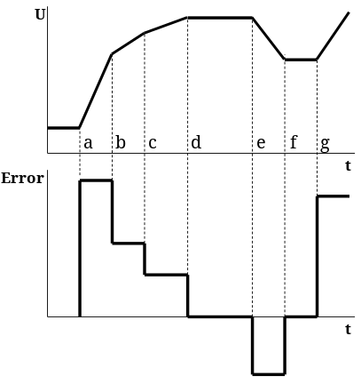

# Elemento Controlador

## ¿Qué es un controlador en un sistema de control?

El controlador compara el valor real de la salida de una planta con la entrada de referencia (el valor deseado), determina el error y produce una señal de control que reducirá la desviación a cero o a un valor pequeño. Los controladores industriales son eléctricos, electrónicos, hidráulicos, neumáticos o alguna combinación de éstos. La manera en la cual el controlador automático produce la señal de control se denomina acción de control.

## Funciones que realiza

## Tipos de controladores

### De acuerdo a la fuente de energía del elemento que genera la acción de control

- Neumáticos (Aire a presión)
- Hidráulicos (Aceite o agua a presión)
- Eléctricos - Electrónicos (Corriente eléctrica)

### De acuerdo a como se genera la acción de control a partir del error

- Todo - Nada (ON - OFF)
- Proporcional (P)
- Integral (I)
- Proporcional Integral (PI)
- Proporcional, Derivativo (PD)
- Proporcional Integral Derivativo (PID)
- Adelanto y/o Atraso de Fase

### De acuerdo a la estrategia de control

- Directo (feedforward) - Realimentado (feedback)
- Serie - Paralelo
- Centralizado - Distribuido
- Cascada, sobrerango, selectivo, anticipatorio, etc

#### Controlador On - Off

Su salida toma solo dos valores (valores extremos).
Esto provoca que el actuador se encuentre siempre en su valor mínimo (0%, totalmente cerrado) o en su valor máximo (100%, totalmente abierto), imponiendo al proceso el mínimo o el máximo de la energía respectivamente.

Se basa en que el controlador tiene sólo dos estados ON/OFF, abierto/cerrado. Si comparamos el valor medido con el valor de referencia, se toma una de las dos posibles acciones dependiendo del signo del error.

Por ejemplo, en un control de temperatura de un refrigerador: Si la Temperatura > Tref. Encender compresor Si la Temperatura < Tref. Apagar compresor.

Es de uso extendido en sistemas industriales y domésticos por ser simple y barato El rango en el que debe moverse la señal e(t) antes que ocurra la conmutación se denomina brecha diferencial (Gap)

Los controladores ON/OFF analógicos están formados por un detector de error (amplificador de diferencias) y un comparador con histéresis.

Se caracteriza por presentar una banda muerta (deadband) o histéresis, que provoca que el error de control nunca sea cero, pero evita que el actuador se dañe por los frecuentes cambios en la salida del controlador.

Producto de la histéresis el error nunca será cero, sino que se mantendrá fluctuando en el rango definido como ± $\Delta E$.

Para reducir el error, definido como 2 $\Delta E$, se puede reducir la banda muerta o histéresis, teniendo cuidado no hacer demasido oscilante la salida del controlador, lo cual pudiera dañar el elemento de acción final.

::: tip Aspectos a notar

- Los controladores On-Off son una solución básica (al problema de control) con limitaciones inherentes.
- Existen compromisos entre comportamiento de la salida y el natural esfuerzo de control.
- Necesitamos ser cuidadosos para no utilizar controles muy agresivos cuando están incluidos retardos temporales.

:::

#### Controlador proporcional

Para sistemas de dinámica lenta, con gran inercia, y que permitan un error de control considerable, es adecuado un regulador on-off.

Pero si lo que se necesita es una respuesta lineal ante los cambios del error de control se debe emplear entonces regulador proporcional.

El controlador proporcional es aquel en el que el elemento final de control efectúa un movimiento proporcional a la magnitud del error. El factor de proporcionalidad es ajustable. La posición del elemento de control final es una función lineal del valor de la variable controlada.

El regulador o controlador proporcional presenta un comportamiento lineal dentro de una banda proporcional (tramo b-c) y fuera de ella actúa como un regulador on-off (tramos a-b y c-d).

Dentro de la banda proporcional, definida entre los puntos b y c, pequeños cambios en el valor del error provocarán que varíe proporcionalmente la salida del regulador (U). Esto permite un control más preciso sobre el proceso.

La Banda Proporcional se define como el cambio en el error (descrito en % de plena escala del error) que causa que U varíe de su valor mínimo a su valor máximo.

La Constante proporcional (KC) del regulador es la pendiente de la recta definida por los puntos b y c. Es decir, la relación entre la variaciṕn de la salida y la variación del error.

En la figura anterior se observan dos líneas:

- La línea azul representa el valor de consigna o de referencia que se le exige al sistema
- La línea roja representa la salida del sistema para valores distintos de K

EL controlador proporcional nunca alcanza el valor de consigna del sistema, por lo que siempre existirá un error entre el valor de referencia y la salida del sistema.

A medida que se aumenta la constante proporcional del sistema, la velocidad del control proporcional aumenta, como se aprecia en las figuras, pero, si no se es cuidadoso pueden aparecer picos de sobre impulso, obteniendo resultados no deseados.

### Controlador integral

Un controlador integral está formado por un integrador, por lo que la razón de cambio (o pendiente) de su salida será proporcional al error de control, según la ecuación:

$\dfrac{pv}{t} = K_i E$

Cuando el error (E) es grande el controlador cambia su salida rápidamente para corregir el error.

En cambio, si E es pequeño la U cambia lentamente, pero continua su variación hasta que E=0.

En la figura se observa que E en el punto a provoca una gran pendiente en U entre los puntos a y b.

En cambio la disminución de E en b provoca una razón de cambio (pendiente) menor en U entre los puntos b y d.

Solo cuando el error es cero, en el tramo d-e, la salida no cambia en absoluto, o sea se mantiene constante. Un error negativo entre e - f genera una pendiente negativa en U.

A contrinuación podemos apreciar un integrador analógico

### Controlador proporcional integral

La acción integral por si sola tiene una respuesta transitoria pobre y lenta. Por ejemplo, en un paso de escalón en el error, el integrador comienza a generar una rampa en su salida cuya pendiente es proporcional a la amplitud del paso.

La acción proporcional en cambio tiene una respuesta transitoria poderosa y rápida. En el caso anterior su salida sería un paso escalón proporcional al paso en el error.

**_Acción proporcional + integral_**

Con la combinación de estas dos acciones se obtiene un controlador que responde rápidamente y es capaz de eliminar el error de estado estacionario

::: tip Recomendaciones al usar un PI

- Cuando se combina con un integrador, la acción proporcional, tiende a oscilar por lo que hay que reducir la Kp para estabilizar el sistema. Sin embargo esto reduce la respuesta rápida del controlador.

- La parte integral del controlador se puede considerar como un offset adaptativo para la acción proporcional. Esta ofrece una salida constante para un error constante y el integrador ajusta el offset para eliminar el error.

- Cuando usamos un PI en procesos con grandes retardos el continuo incremento natural del integrador puede causar en el regulador una acción correctora antes de que la respuesta demorada del proceso se realimente.
  :::

### Controlador derivativo

En muchos procesos el controlador proporcional ofrece una respuesta rápida ante un paso en el error y el integral, aunque más lento, elimina el error de estado estacionario.

Pero en procesos con gran inercia es necesario una acción que tenga en cuenta la tendencia del error de control, y se anticipe a él. Como se verá esto se consigue con la acción derivativa.

La salida del controlador derivativo es proporcional a la razón de cambio (pendiente) del error de control.

La figura muestra la respuesta de la acción derivativa.

Inicialmente el error de mantiene constante en cero por lo que la salida del derivador será cero durante ese tiempo.

En el instante a se produse un paso en el Error, provocando una pendiente infinita a la salida del regulador que conlleva a que se sature.

Durante los intervalos a-b, b-c y e-f, el error es constante (aunque no es cero), por lo que la pendiente será cero igual que la salida del regulador.

En cambio en los tramos c-d, d-e y f-g ocurre una variación constante del error (pendiente), lo cual provoca valores constantes en la salida del controlador. Al aumentar la pendiente aumenta en valor positivo la salida, como en el tramo c-e. Pero al disminuir la pendiente la salida se hace negativa, como en el f-g.

Analizando el esquema básico de un amplificador diferenciador (derivador) se nota que con respecto a un integrador se intercambió la resistencia y el capacitor. Por tanto:

Es importante resaltar que el controlador derivativo genera una salida diferente de cero solo cuando el error cambia.

Por tanto en sistemas donde el error permanece constante durante un tiempo, no se obtendrá salida del controlador en ese tiempo. Es por ello que debe ser empleado en combinación con otro tipo de acción de control.

### Controlador PID (Proporcional-Integral-Derivativo)

Responde rápido ante cambios en el error de control y proporcional a este.

Que no presente error en estado estacionario.

Que estabilice al sistema ante grandes inercias y compense las mismas con una respuesta proporcional a la razón de cambio del error.

En la siguiente figura se analiza el comportamiento de un regulador de este tipo, denominado PID.

La implementación práctica de un PID se muestra en el esquema y se denomina PID paralelo.

La implementación paralela del PID presenta problemas cuando se aplican cambios bruscos en la referencia. Esto es común cuando la referencia del controlador se modifica manualmente, se conecta en cascada con otro controlador o a un sistema remoto (autómata, SCADA, etc.)

Un paso en la referencia causa un paso en el error y por tanto la acción derivativa responde a la razón de cambio de este y satura la salida del controlador.

Esto provoca que el actuador tome un valor extremo y que el proceso se esfuerce en absorber este exceso de energía, ocasionando sobrecrestas, que durarán hasta que el estado estable sea alcanzado nuevamente.

Una solución a esto es trabajar en la acción derivativa con la variable de proceso (PV) y no con el error (E), de esta forma los cambios en la referencia no afectarán al diferenciador.

El circuito práctico de esta solución se muestra en la figura , pero observen los cambios realizados:

### Corrección de la Saturación Integral (Integral Windup)

Otro problema presentado en la implementación práctica del PID paralelo se relaciona con el hecho de que la acción integral no deja de cambiar su salida mientras el error no sea cero.

Si el error se mantiene suficiente tiempo, la salida del controlador puede saturarse, producto de la acción proporcional y del crecimiento continuo de la integral (b).

Cuando el proceso finalmente responde (c) y el error comienza a disminuir, es necesario entonces
que la salida del controlador también lo haga (regresando a su estado anterior), pero esto no sucede.

La acción proporcional reduce su salida inmediatamente, pero la integral necesita que el error cambie de signo para que su salida cambie el signo de su pendiente (lo cual no sucede hasta d)

Esto mantiene al controlador saturado (b-d) mientras el error sigue disminuyendo hasta cero (d) y cambiando de signo.

Así comienza una sobrecresta negativa provocada por la saturación mantenida en U (e).

A partir de que el error cambia de signo (d) la acción integral comienza a disminuir modularmente su salida (cambia el signo de la pendiente), pero pasará algún tiempo para que el sistema regrese a un estado estable.

Este comportamiento puede prevenirse monitoreando la salida del controlador y actuando sobre la entrada de la acción integral, de la siguiente manera:

Cuando la salida del controlador alcanza el 100% de su valor (o un valor prefijado), la entrada de la acción integral es forzada a cero, provocando que su salida deje de crecer.

Una vez que la U disminuye por debajo de 100% (o del valor prefijado), el integrador es reconectado y sigue respondiendo al error.

El esquema práctico se muestra a continuación.

El esquema contempla un comparador que acciona un interruptor (relay, interruptor analógico, transistor) que lleva a la entrada del integrador a GND.

Se divide Ri en dos partes, Ra y Rb. Ra evita sobrecargar la salida del amplificador de error y los contactos del interruptor.

El potenciómetro en U6 permite fijar el valor de U en que se detiene el incremento de la acción integral.

### Transferencia Automático/Manual sin saltos o sacudidas (Bumpless Auto/Manual Transfer)

El cambio de control automático a manual, o viceversa, es algo necesario en muchos procesos, y es usual en puestas en marcha y las paradas.

Sin embargo si esto no se realiza con cuidado puede ser desastroso para los actuadores y para el proceso.

Si al realizar la transferencia, la salida del controlador no tiene el mismo valor que la manual, se provoca un paso escalón en U y por tanto un posible daño en el actuador.

::: tip Opcional
Estudiar transferencia Automático/Manual
:::
