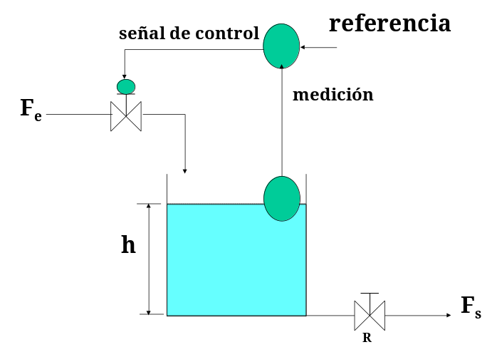

# Sistemas de control

## Introducción

Los sistemas de control han sido de gran impacto para el desarrollo de nuestra sociedad ya que han permitido:

- Automatizar tareas humanas repetitivas, tediosas y/o peligrosas.
- Trabajar con tolerancias mucho menores, mejorando la calidad de los productos.
- Disminuir costos de producción en mano de obra e insumos.
- Mejorar la seguridad de operación de las máquinas y procesos.

Los sistemas de control tienen vastas áreas de aplicación en:

- Industrias del transporte, incluyendo la aeroespacial.
- Procesos químicos y biológicos.
- Sistemas mecánicos, eléctricos y electromecánicos.
- Agroindustria.
- Industrias de procesos y de manufactura.
- Sistemas económicos, políticos y sociales.

Los encontramos en nuestra cotidianidad, desde la nevera hasta el sistema de control de combustión electrónica de los automóviles y así como en nuestro propio cuerpo:

- Control de la temperatura corporal.
- Presión arterial.
- Equilibrio.

El simple acto de señalar con el dedo es un sistema de control. Ahora bien, su aplicación requiere de varias tecnologías como la informática, la eléctrica, la electrónica y las comunicaciones; también exige buena fundamentación matemática y conocimientos del proceso a controlar. De lo anterior se deriva que los sistemas de control sean un área multidisciplinar y transversal a las ingenierías y a otras ciencias. Concepto de Sistema: Conjunto de elementos y reglas que organizados e interrelacionados entre si, contribuyen a generar un resultado. Poseen características propias que los definen, que pueden ser constantes (parámetros del sistema) y cambiantes en el tiempo (variables del sistema) las cuales permiten determinar su comportamiento.

- Parametros del sistema: Estructura del sistema, propiedades inmutables o características esenciales o aquellas que no cambian.

- Variables: Elementos que si van cambiando y que evolucionan además representan de alguna manera la evolución del sistema en el tiempo.

- Variable de entrada: Es una variable del sistema tal que una modificación de su magnitud o condición puede alterar el estado del sistema.

- Variable de salida: es una variable del sistema cuya magnitud o condición se mide.

- Perturbación: es una señal que tiende a afectar el valor de la salida de un sistema.

Sistema estable

Sistema inestable

Sistema con estabilidad crítica

### Estabilidad e inestabilidad de un sistema

La estabilidad en un Sistema de Control es su propiedad mas importante tanto es asi que podemos decir que no se puede hablar Sistema de Control si este no es Estable. Un sistema es estable si responde con una variación finita a variaciones finitas de sus señales de entrada. Si se considera una señal lineal e invariante en el tiempo, la inestabilidad del sistema supondrá una respuesta que aumenta o disminuye de forma exponencial o una oscilación cuya amplitud aumenta exponencialmente.

## Sistema de control en lazo abierto

La salida del sistema no tiene efecto sobre la acción de control (no se mide ni se retroalimenta).

Para cada mando o entrada corresponde una operación determinada.

En el control a lazo abierto la exactitud del control depende de la calibración.

Ejemplos

- Hornillas eléctricas o de gas
- Horno de cocina de gas
- Lavadoras (las más antiguas)
- Ventiladores

::: danger Importante
Si ocurre una perturbación, el sistema de control no corrige su efecto.
:::

::: tip Importante
No presenta problemas de estabilidad.
:::

## Sistema de control en lazo cerrado

Existen dos tipos de control a lazo cerrado:

- Manual
- Automático

### Sistemas de control a lazo cerrado operados manualmente

- El operario detecta el nivel del tanque y lo controla abriendo o cerrando la válvula.
- No puede asegurarse un control preciso.

Si modelamos la imagen anterior en un diagrama en bloques obtendríamos algo así

### Sistemas de control operados automáticamente

En la figura anterior se simula un tanque con un flotante que envía lecturas de mediciones a un controlador, el cual a partir de esa señal y una señal de referencia (o valor de consigna), puede enviar una señal de control al actuador del sistema, es este caso, la válvula.

Mediante el control de la apertura de la válvula de entrada al tanque se puede controlar si el nivel del mismo aumenta o no.

En la siguiente figura se observa un diagrama en bloques simple del ejemplo anterior:

### Comparación de los sistemas de control en lazo abierto y en lazo cerrado

| Lazo abierto                                          | Lazo cerrado                                                                                                |
| ----------------------------------------------------- | ----------------------------------------------------------------------------------------------------------- |
| No adecuado cuando el proceso presenta perturbaciones | Se utiliza en procesos que pueden perturbaciones                                                            |
| La exactitud depende de la calibración                | La exactitud depende de las características del proceso, de la acción de control y del tipo de perturbación |
| No tiene problemas de estabilidad                     | Pueden presentar problemas de estabilidad                                                                   |

### Diagrama en bloques de sistema de control a lazo cerrado

De lo visto anteriormente, se puede plantear el diagrama en bloques de un sistema de control a lazo cerrado de la siguiente manera:

De la figura anterior:

**r(t)**: señal de referencia, valor deseado, punto de consigna, valor prescrito (set point)

**e(t)**: señal de error e(t) = r(t) - b(t)

**u(t)**: señal de control

**m(t)**: variable manipulada

**c(t)**: variable controlada

**b(t)**: variable medida

**n(t)**: señal perturbadora, perturbación, carga

## Elementos que componen un sistema de control

### CONTROLADORES

El controlador compara el valor real de la salida de una planta con la entrada de referencia (el valor deseado), determina el error y produce una señal de control que reducirá la desviación a cero o a un valor pequeño. Los controladores industriales son eléctricos, electrónicos, hidráulicos, neumáticos o alguna combinación de éstos. La manera en la cual el controlador automático produce la señal de control se denomina acción de control.

#### DE ACUERDO A LA FUENTE DE ENERGIA del elemento que genera la acción de control:

- Neumáticos (Aire a presión).
- Hidráulicos (Aceite o agua a presión).
- Eléctricos - Electrónicos (Corriente eléctrica).

#### DE ACUERDO A COMO SE GENERA LA ACCION DE CONTROL a partir del error

- Todo - Nada (ON - OFF).
- Proporcional (P)
- Integral (I)
- Proporcional Integral (PI)
- Proporcional, Derivativo (PD)
- Proporcional Integral Derivativo (PID).
- Adelanto y/o Atraso de Fase.

#### DE ACUERDO A LA ESTRATEGIA DE CONTROL

- Directo (feedforward) - Realimentado (feedback).
- Serie - Paralelo.
- Centralizado - Distribuido
- Cascada, sobrerango, selectivo, anticipatorio, etc.

## Ejemplos de algunos de estos sistemas

Aunque la teoría de control sea normalmente aplicada en robótica, electrónica o automatización, también cuenta con otras múltiples aplicaciones como la gestión del trafíco de redes de computadoras, hacer predicciónes de el comportamiento de los animales, contrucción de modelos de crecimiento económico e incluso modelos de sistemas fisiológicos. Por ejemplo, se puede decir que los procesos biológicos en nuestro organismo usan alguna forma de control: temperatura del cuerpo, presión en la sangre, glucosa, pH e incluso los reflejos de los músculos esqueléticos.Todos estos actúan como un sistema de control retroalimentado.

Por ejemplo, si gastas mucho tiempo en un lugar caluroso, la temperatura de tu cuerpo va a aumentar y los receptores térmicos de la piel detectan el cambio, por lo que alertan a una porción de tu cerebro llamada el hipotálamo. Así, el hipótalamo señala a las glándulas sudoríparas que empiecen a trabajar para que finalmente la temperatura regrese a la normalidad.

En robótica, los sistemas de control son extremádamente importantes. Son usados en la ejecución de comandos para el movimiento de un robot de tal manera que siga un determinado camino o mantener una velocidad deseada. También son usados en drones aéreos o acuáticos , para mantener valores deseados de roll, pitch y yaw (ejes sobre los que gira).

El control de temperatura en una habitación es un ejemplo claro y típico de una aplicación de ingeniería de control. El objetivo es mantener la temperatura de una habitación en un valor deseado, aunque la apertura de puertas y ventanas y la temperatura en el exterior hagan que la cantidad de calor que pierde la habitación sean variables (perturbaciones externas). Para alcanzar el objetivo, el sistema de calefacción debe modificarse para compensar esas perturbaciones. Esto se hace a través del termostato, que mide la temperatura actual y la temperatura deseada, y modifica la temperatura del agua del sistema de calefacción para reducir la diferencia entre las dos temperaturas.
