# Características generales de las mediciones

## Teoría de errores en los Sistemas de Medición

Los instrumentos de medición son los que hacen posible la observación de determinado fenómeno físico y su cuantificación en el proceso de medición.

Al realizar una medición en el mundo real, los instrumentos no son sistemas ideales, por lo tanto, tienen una serie de limitaciones que se deben tomar en cuenta para poder juzgar si afectan de alguna manera las mediciones que se realizan, y así determinar la veracidad de las mediciones.

### Instrumento

Dispositivo para determinar el valor o magnitud de una cantidad o variable observada.

#### Características que definen el comportamiento de los instrumentos

- Error
- Exactitud y precisión
- Resolución
- Sensibilidad
- Gama y escala
- Campo de medida
- Alcance
- Banda de frecuencia
- Linealidad
- Eficiencia
- Respuesta estática y dinámica

Adicionalmente a estos parámetros, se pueden agregar los análisis estadísticos de media, varianza, desviación estándar, entre otros, que frecuentemente son aplicados a las mediciones.

Estos parámetros estadísticos permiten conformar una idea más completa del comportamiento del sistema.

### Error

Diferencia entre el valor observado o medido y el valor verdadero o exacto de una variable.

#### Clasificación de los errores

- Sistemáticos
- Aleatorios o fortuitos

##### Sistemáticos

Tienen causas conocidas, influyen siempre de la misma manera.

Son en parte de origen humano, como la mala lectura de los instrumentos, ajuste incorrecto y instalación inapropiada.

También se deben a fallas de los instrumentos, como partes defectuosas o desgastadas, y efectos ambientales sobre el equipo. Estos errores pueden evitarse mediante una buena elección del instrumento, aplicación de factores de corrección, o recalibrando los mismos contra un patrón.

##### Aleatorios o fortuitos

Se deben a causas desconocidas y ocurren incluso cuando todos los errores sistemáticos han sido considerados.

Para compensar estos errores debe incrementarse el número de lecturas y usar medios estadísticos para lograr una mejor aproximación del valor real de la cantidad medida.

#### Errores a partir de las mediciones

##### Error absoluto

Es directamente la diferencia entre el valor verdadero y el valor medido.

Donde:

$e = X_n - X_0$

$X_n$: valor esperado o valor nominal

$X_0$: valor medido

##### Error relativo

Se usa cuando se requiere comparar dos errores de dos magnitudes medidas muy diferentes, y el error absoluto no es suficiente.

$error\_relativo = \dfrac{error\_absoluto}{valor\_esperado} = \vert\dfrac{X_n - X_0}{X_n}\vert$

#### Propagación de errores

Cuando se realiza una medición indirecta, (la variable a determinar depende de más de una medición) surge la necesidad de evaluar como pesan cada uno de los errores en el error del resultado final.

A este proceso se le denomina, calculo de la ley de propagación de errores límites.

#### Exactitud

Aproximación con la cual la lectura de un instrumento se acerca al valor real de la variable medida.

Esta característica especifica el error con el cual se mide y se relaciona con la "ausencia de error" en las mediciones. Puede expresarse en términos de los conceptos de precisión y "bias". El "bias" se refiere a la parte constante del error y se relaciona con el error sistemático.

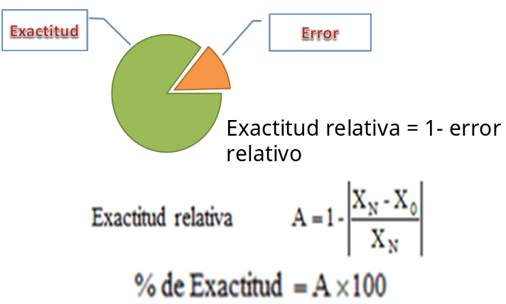

#### Resolución

La resolución de un instrumento es el menor incremento de la variable bajo medición que puede ser detectado con certeza por dicho instrumento. Esta característica está relacionada con la precisión.

#### Sensibilidad

La sensibilidad de un instrumento es la relación entre la respuesta del instrumento (número de divisiones recorridas) y la magnitud de la cantidad que estamos midiendo.

#### Gama y Escala

La gama de un instrumento se define como la diferencia entre la indicación mayor y la menor que puede ofrecer el instrumento.

La gama puede estar dividida en varias escalas o constar de una sola.

Por ejemplo, el amperímetro de la A tiene una gama de 0 a 5 mA, y una sola escala, mientras que el B tiene una gama de 0 a 500 mA, dividida en 5 escalas, las cuales van respectivamente de 0 a 0.05 mA; de 0 a 0.5 mA; de 0 a 5 mA; de 0 a 50 mA y de 0 a 500 mA.

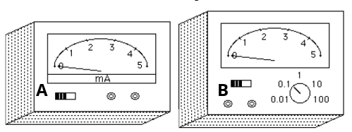

#### Banda de frecuencias

Es el rango de frecuencias para el que el instrumento es capaz de responder cuando mide en condiciones dinámicas.

Los instrumentos pueden estar diseáados para realizar mediciones en régimen continuo (DC), o sobre señales alternas (AC), bien sea en el rango de frecuencias alrededor de 60 Hz, o en cualquier otro rango de frecuencias.

#### Linealidad

La linealidad significa que para un determinado incremento del parámetro que estamos midiendo, el incremento de la respuesta correspondiente del indicador o la salida sea siempre el mismo, independientemente de la posición de este.

#### Eficiencia

La eficiencia de un instrumento se define como la indicación del instrumento dividida por la potencia que absorbe del circuito para poder realizar la medición.

#### Precisión

Es la tolerancia de medida o de transmisión del instrumento (intervalo donde es admisible que se sitúe la magnitud de la medida), y define los límites de los errores cometidos cuando el instrumento se emplea en condiciones normales de servicio durante un período de tiempo determinado.

- Realmente, la precisión varía para cada punto del campo de medida, aunque el fabricante especifica un valor de la misma para el instrumento.
- El valor ofrecido por el fabricante será el peor valor de precisión para ese instrumento.

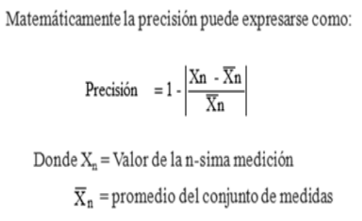

##### Formas de expresar la precisión

- Porciento (%) del alcance:

  Se le llama también Clase de Precisión del instrumento.

  ::: tip Ejemplo

  Un instrumento de medición de temperatura de alcance 200ºC y precisión $±0,5 %$ del alcance, para una lectura de 150ºC, el error máximo esperado será:

  ±0,5 \* 200ºC / 100 = ±1ºC

  Luego, el valor real de la temperatura estará comprendido entre 149 y 151 ºC
  :::

- Directamente, en unidades de la variable medida.
  ::: tip Ejemplo

  Precisión de ±1ºC.
  :::

- Tanto por ciento (%) de la lectura efectuada.

  ::: tip Ejemplo

  ±1% de la lectura. Si la lectura efectuada fue 150ºC, el error máximo esperado sería ±1,5ºC.
  :::

- Tanto por ciento (%) del valor máximo del campo de medida.
  ::: tip Ejemplo
  ±0,5% de 300ºC. El error máximo esperado sería de ±1,5ºC.
  :::

- Tanto por ciento de la longitud de la escala
  ::: tip Ejemplo
  Si la longitud de la escala de un instrumento es de 100 mm, una precisión de ±0,5% representará ±0,5mm de la escala; si el alcance del instrumento es 200ºC, cada mm de la escala será:

  200ºC/100mm = 2ºC/mm

  luego el máximo error esperado será de

  ± 0,5mm x 2ºC/mm = ± 1 ºC.
  :::

## Características estáticas y dinámicas de los instrumentos

### Características estáticas

Para determinar las características estáticas de un instrumento se utiliza la calibración.

La calibración consiste en la asignación de valores constantes a la salida correspondientes a valores constantes en la entrada, bajo condiciones estables de trabajo para todos los puntos de calibración.

#### Curva de calibración (static transfer function)

La curva de calibración es la relación entre la entrada al sensor o sistema y su salida en régimen estático

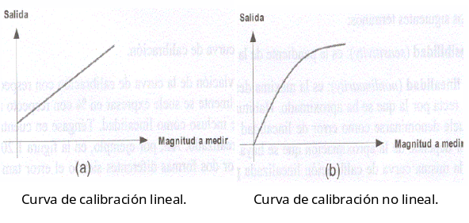

Para definir la curva adecuadamente se necesita como mínimo indicar su forma y sus límites. Estos últimos se especifican con algunos de los siguientes parámetros

- Campo de medida (range)
- Alcance, fondo de escala (span, input full scale)
- Salida a fondo de scala (full scale output)

##### Campo de medida (range)

Conjunto de valores comprendidos entre los límites superior e inferior entre los que puede efectuarse la medida.

##### Alcance (span)

Es la diferencia entre los límites superior e inferior de medida (el alcance también es conocido con los términos Gama o Amplitud).

##### Plena escala de la salida (full scale output)

Es la diferencia entre las salidas para los extremos del campo de medida

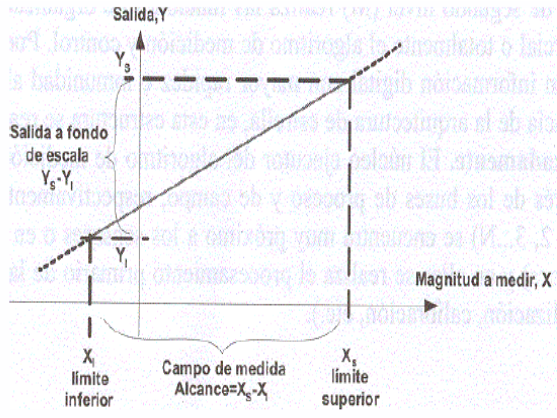

#### Linealización de la curva de calibración

Además, es necesario indicar, de algún modo, el error cometido en la aproximación, es decir, la diferencia entre la curva real y la curva linealizada. Para definir la curva linealizada se emplean los siguientes términos:

- Sensibilidad (sensitivity)

Es la pendiente de la curva de calibración.

- No linealidad (nonlinearity)

Es la máxima desviación de la curva de calibración con respecto a la línea recta por la que se ha aproximado

La linealización puede expresarse en varias formas

- Linealidad de los puntos extremos:
  Se escogen los dos puntos extremos y se traza una línea, luego se calcula la máxima desviación respecto a la carga y descarga del instrumento.
- Linealidad independiente:
  Se trazan dos líneas paralelas que envuelvan a la curva de la Histéresis. Se traza una línea mediana (cuya pendiente es la semisuma de las pendientes de las dos líneas trazadas) y se calcula la mayor diferencia con relación a dicha mediana.
- Linealidad de mínimos cuadrados:
  Es la línea recta para la cual la suma de los cuadrados de la distancia a la recta (error) es mínima.

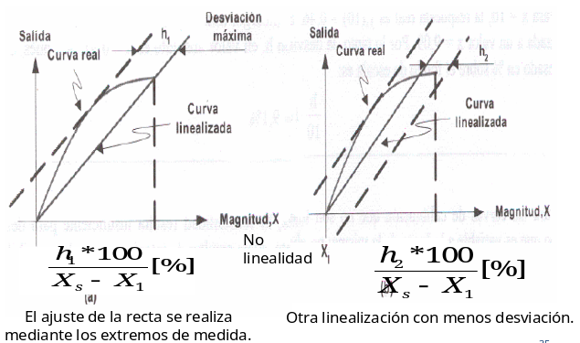
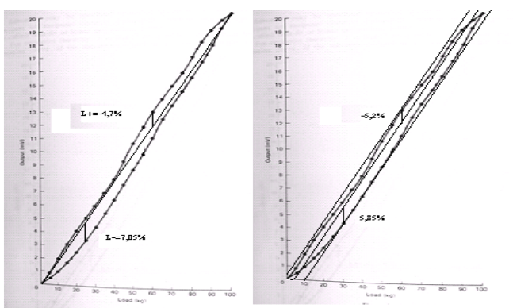

[(Opcional) Ver mínimos cuadrados](https://es.wikipedia.org/wiki/M%C3%ADnimos_cuadrados)

Para las curvas de calibración que no son lineales, la sensibilidad resulta insuficiente para definirlas puesto que es variable a lo largo de la misma; no obstante, suele resultar de interés conocer las sensibilidades máxima y mínima.

- Generalmente las curvas se definen mediante una tabla indicando para cada entrada la correspondiente salida.
- También resulta muy habitual aproximar la salida a alguna función matemática, siendo necesario especificar, de nuevo, el error cometido en tal aproximación.

#### Zona muerta (dead zone)

Es el campo de valores de la variable que no hace variar la indicación. También se define como la región de la curva de calibración que presenta una sensibilidad nula.

#### Histéresis (hysteresis)

Es la diferencia en la medida dependiendo del sentido en el que se ha alcanzado.

Cuando se realiza una calibración se hacen dos corridas una en dirección al ascenso de la lectura (carga) y otra en descenso (descarga). Generalmente en el ascenso, la indicación es por debajo de la que debe tener y en el descenso por encima.

La histéresis se calcula por la máxima variación de la lectura encontrada para cada punto de la corrida dividida por el valor del alcance del instrumento.

$H = max\dfrac{\vert Y_2up - Y_1down \vert}{alcance}*100$

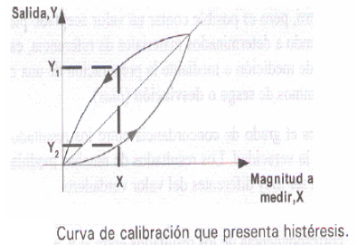

#### Deriva (drift)

Es la variación de algún aspecto de la curva de calibración con respecto a algún parámetro ambiental (temperatura, humedad, etc., siempre que el propio parámetro no sea el objeto de la medida) o con respecto al tiempo.

#### Saturación

Es el nivel de entrada partir del cual la sensibilidad disminuye de forma significativa

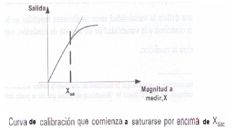

#### Repetibilidad

Es la capacidad de reproducción de la salida del instrumento (valor indicado o transmitido) al medir repetidamente idénticos valores de la variable en las mismas condiciones de servicio y en el mismo sentido de variación recorriendo todo el campo de medida.

Se expresa de dos formas

$R_1 = \dfrac{lect\_max - lect\_min}{alcance}*100$

$R_2 = \dfrac{max\_valor - promedio}{alcance}*100$

##### Ejemplo

En una aplicación son utilizadas tres celdas de carga con características similares. Una masa de 50 kg es colocada en cada celda 10 veces. Estas celdas de carga dan una salida de 0 a 20 mV para una masa de 0 a 100 kg.

En la tabla se recogen los resultados. Construya una gráfica con los mismos y comente la repetibilidad de los instrumentos.

##### Tabla de valores

| Número de prueba | Celda A (mV) | Celda B (mV) | Celda C (mV) |
| ---------------- | ------------ | ------------ | ------------ |
| 1                | 10.02        | 11.50        | 10.00        |
| 2                | 10.96        | 11.53        | 10.03        |
| 3                | 11.20        | 11.52        | 10.02        |
| 4                | 9.39         | 11.47        | 9.93         |
| 5                | 10.50        | 11.46        | 9.92         |
| 6                | 10.94        | 11.51        | 10.01        |
| 7                | 9.02         | 11.58        | 10.08        |
| 8                | 9.47         | 11.50        | 10.00        |
| 9                | 10.08        | 11.49        | 9.97         |
| 10               | 9.32         | 11.48        | 9.98         |

##### Cálculos de repetibilidad

| Cálculos        | Celda A (mV) | Celda B (mV) | Celda C (mV) |
| --------------- | ------------ | ------------ | ------------ |
| Máximo          | 11.2         | 11.58        | 10.08        |
| Promedio        | 10.084       | 11.504       | 9.994        |
| Mínimo          | 9.02         | 11.46        | 9.92         |
| Repetibilidad 1 | 11.9         | 0.6          | 0.8          |
| Repetibilidad 2 | 5.58         | 0.38         | 0.43         |

##### Curva de repetibilidad

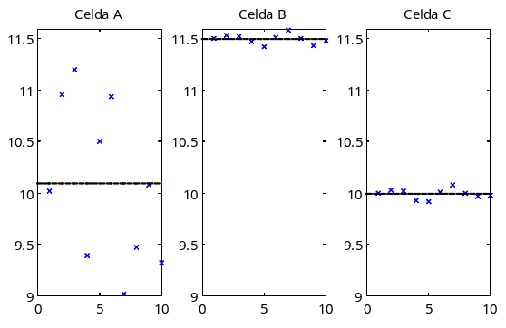

- ¿Cuál es la mejor celda desde el punto de vista de la repetibilidad?

  R/ Celda B

- ¿Qué podemos decir respecto a la exactitud de la medida con las tres celdas?

  R/ La medida real sería 10 mV, por lo que el error absoluto máximo de cada celda será:

|                                          | Celda A | Celda B | Celda C |
| ---------------------------------------- | ------- | ------- | ------- |
| $e\_max=max\vert x\_med - x\_real \vert$ | 1.2     | 1.58    | 0.08    |

- Teniendo en cuenta ambos aspectos, ¿qué celda escogería Ud?

  R/ La celda C.

### Características dinámicas

Las características dinámicas de los instrumentos se refieren al comportamiento de estos cuando en sus estímulos (entradas) ocurre un cambio, o sea, cómo responde este instrumento durante el período transitorio que transcurre desde el momento del cambio hasta que se alcanza un nuevo estado estacionario.

Si la variable medida tiene una velocidad de cambio tal que el instrumento no puede seguir sus variaciones, este simplemente será inútil para ese fin.

El comportamiento dinámico de un instrumento de medida puede considerarse como un ejemplo específico del comportamiento dinámico de los sistemas.

Es frecuente caracterizar el comportamiento dinámico del instrumento empleando el modelo en forma de función de transferencia.

Para esto debe expresarse la ecuación diferencial en "variables de desviación". De esta manera, se cumple la definición de la función de transferencia.

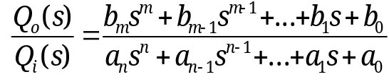

#### Instrumento de orden cero

$a_0q_0=b_0q_i$

La sensibilidad estática (ganancia de estado estacionario) es

$q_0=\dfrac{b_0}{a_0}q_i$

$K=\dfrac{b_0}{a_0}$

Este modelo representa el comportamiento ideal de un instrumento. La salida sigue perfectamente la variación de la entrada.

::: tip Ejemplo

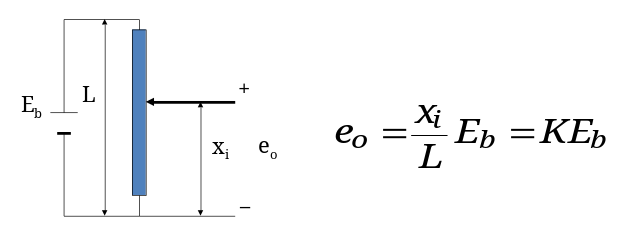
:::

#### Instrumento de primer orden

$a_1q_0' + a_0q_0=b_0q_i$

$\dfrac{a_1}{a_0}q_0' + q_0=\dfrac{b_0}{a_0}q_i$

Que puede expresarse como

$\dfrac{Q_0(s)}{Q_i(s)}=\dfrac{K}{\tau s+1}$

Donde:

$K = \dfrac{b_0}{a_0} = sensibilidad\_estatica$

$\tau = \dfrac{a_1}{a_0} = constante\_de\_tiempo$

##### Ejemplo instrumento primer orden

El termómetro de vidrio, midiendo la temperatura del líquido.

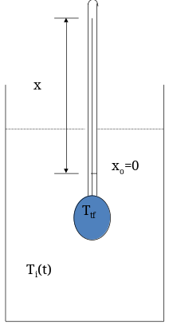

$(V_b \rho C_e s + UA_b)T_t(s) = UA_bT_i(s)$

$\dfrac{T_t(s)}{T_i(s)}=\dfrac{UA_b}{V_b \rho C_e s + UA_b}$

$\dfrac{T_t(s)}{T_i(s)}=\dfrac{1}{ \dfrac {V_b \rho C_e}{UA_b}s + 1}$

$\tau = \dfrac {V_b \rho C_e}{UA_b}$

$V_b$ - volumen del bulbo $m^3$

$\rho$ - densidad másica del fluido del termómetro $kg/m^3$

$C_e$ - calor específico del fluido del termómetro J/kgºC

$A_b$ - área de transferencia de calor de la pared del bulbo $m^2$

$U$ - coeficiente global de transferencia de calor a través de la pared del bulbo W/($m^2$ºC)

Respuesta a un paso escalón del termómetro de vidrio

##### Respuesta temporal

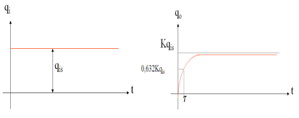

##### Respuesta frecuencial

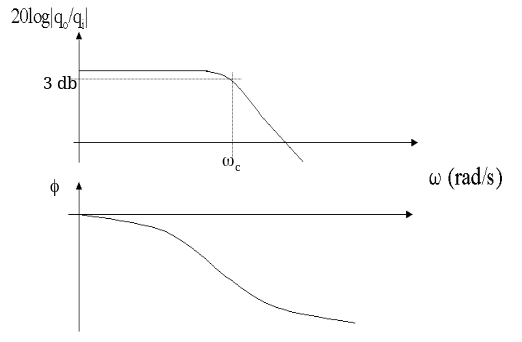

#### Análisis estadísticos

El análisis estadístico de datos de mediciones es una práctica común ya que permite obtener una determinación analítica de la incertidumbre del resultado final para caracterizar a los errores restantes (aleatorios o fortuitos).

Para realizar el análisis y aplicar los métodos estadísticos mencionados, es necesario contar con un gran número de mediciones, o sea contar con una población de datos, y además los errores sistemáticos deben ser pequeños en comparación con los errores residuales (o aleatorios).

#### Criterios generales de selección de un instrumento

- El propósito de la medición.
- La magnitud a medir.
- Campo de valores que se visualizará en los datos finales.
- Condiciones de sobrecarga.
- Precisión de la medición.
- Características dinámicas de la magnitud a medir.
- Respuesta de frecuencia o tiempo de respuesta.
- Naturaleza física o química del medio donde se realiza la medición.
- Instalación del transductor.
- Las variaciones del medio podrán alterar la indicación del transductor.

::: tip
Las características estáticas constituyen un punto de partida fundamental en la calibración de todos los instrumentos de medición.
:::

::: tip
Por otro lado, las características dinámicas aportan varios elementos para una buena selección de un instrumento de medición.
:::
