# Mediciones

La Automatización Industrial se ha convertido en un medio fundamental para mejorar el rendimiento y la eficiencia productiva de cualquier industria moderna.

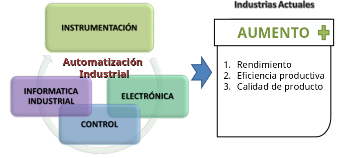

Los objetivos de las mediciones industriales (industria de transformación) están básicamente orientadas a:

- Garantizar la productividad, calidad y cantidad en los procesos industriales (mediciones de proceso y de compra venta (o para transferencia de custodia))
- Garantizar la seguridad de los procesos industriales, tanto la integridad física de las instalaciones, como de los operadores, las poblaciones y en general del entorno donde se ubican las plantas (mediciones para sistemas de parada de emergencia (Emergency Shutdown))
- Minimizar el impacto ambiental de los procesos industriales.

En función del objetivo de la medición se seleccionan:

- Los principios de los medidores a utilizar.
- La forma de instalarlos y explotarlos.
- Los requisitos metrológicos que debe cumplir.
- Los requisitos no metrológicos que debe cumplir
- La forma de implementar su soporte metrológico (Calibración, Verificación, etc...)

::: tip Citando a J. Ferrero
La instrumentación comprende todas las técnicas, equipos y metodologías relacionadas con el diseñoo, la construcción y la aplicación de dispositivos físicos para mejorar, completar y aumentar la eficiencia de los mecanismos de percepción del ser humano
:::

## Proceso de medición

Es el conjunto de operaciones que tiene como objetivo determinar el valor o estado de una magnitud.

### ¿Por qué se mide en la industria?

- Monitorización de procesos y aplicaciones.
- Control de procesos y aplicaciones.
- Análisis experimental.

### Variables físicas medidas frecuentemente en la industria

| Naturaleza | Tipo de variable                                                                     |
| ---------- | ------------------------------------------------------------------------------------ |
| Mecánica   | Desplazamiento, velocidad, aceleración, fuerza, presión, masa, flujo, etc.           |
| Térmica    | Temperatura, calor, entropía, etc.                                                   |
| Magnética  | Campo magnético, flujo, permeabilidad magnética, etc.                                |
| Eléctrica  | Carga, corriente, tensión, resistencia, conductancia, permitividad dieléctrica, etc. |
| Óptica     | Rayos gamma, rayos X, ultravioleta, visible, infrarrojo, microondas, etc.            |
| Química    | Humedad, pH, concentración iónica, análisis de gases, etc.                           |

## Sistema de medición

Es el conjunto de operaciones realizadas con la finalidad de obtener información acerca de un proceso físico y presentar dicha información de manera adecuada a un observador o a otro sistema técnico de control.

El siguiente diagrama representa un sistema de medición:

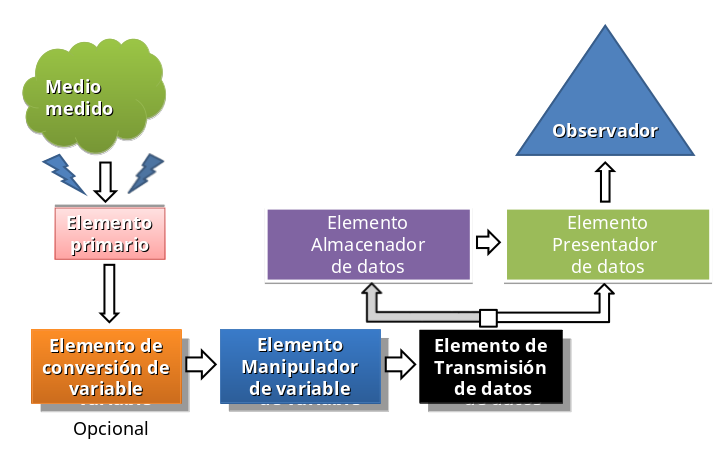

### Elemento Primario (sensor)

Es el primero que recibe la energía del medio a medir y produce una salida que depende, en alguna forma, de la cantidad medida.

### Elemento de conversión de variable

Convierte la salida del elemento primario que es una variable física (desplazamiento, tensión u otra variable) en otra más conveniente mientras conserva la información contenida en la señal original.

### Elemento manipulador de variable

Realiza un cambio del valor numérico de acuerdo con alguna regla definida pero conservando la naturaleza física de la variable

::: tip Ejemplo
Un amplificador acepta una señal de tensión pequeña como entrada y produce una señal de salida en tensión proporcional a esta
:::

### Elemento transmisor de datos

Transmite la información cuando los elementos funcionales del instrumento están físicamente separados.

El transmisor puede ser muy simple o tan complejo como un sistema telemétrico que incluya satélites.

### Elemento de almacenamiento de datos

Almacena la información obtenida por el sistema de medición para su posterior análisis o post-procesamiento. Se suelen emplear registradores, memorias o discos.

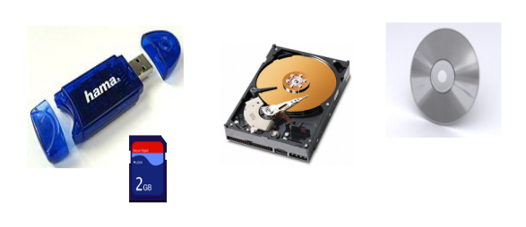

### Elemento presentador de datos

Muestra una cantidad para comunicar la información al humano, el cual tiene intenciones de supervisar, controlar o analizar la medición. Puede ser un indicador, un registrador, o una pantalla (display) alfanumérica.

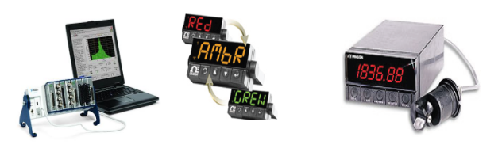

## Principales funciones en un sistema de medición

También se pudiera decir que un sistema de medición:

Es el conjunto de operaciones realizadas con la finalidad de obtener información acerca de un proceso físico y presentar dicha información de manera adecuada a un observador o a otro sistema técnico de control.

Está sería otra representación de un sistema de medición

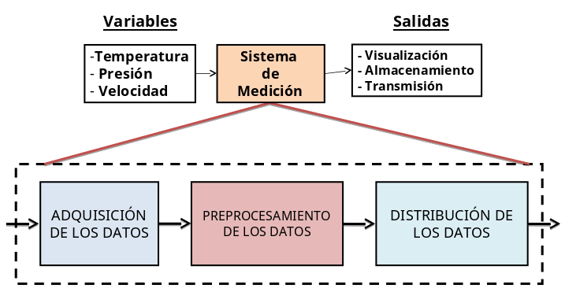

### Adquisición de datos

La información de las variables es adquirida y convertida en una señal eléctrica.

### Pre-procesamiento de datos

Consiste en el procesamiento, selección y manipulación de los datos con arreglo a los objetivos perseguidos. Esta función suele ser realizada por un procesador digital.

### Distribución de datos

El valor medido se presenta a un observador se almacena o bien se transmite a otro sistema.

## Elementos de un sistema de medición

Los elementos de un sistema de medición se pueden subdividir en los siguientes elementos:

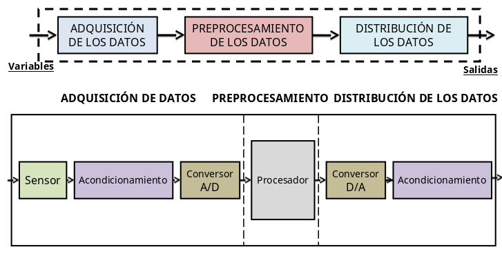

La etapa de acondicionamiento puede consistir en realizar alguna de las siguientes operaciones:

**Amplificación**: Incrementar el nivel de potencia de la señal.

**Filtrado**: Eliminar las componentes de la señal no deseadas.

**Linealización**: Obtener una señal de salida que varíe linealmente con la variable que se desea medir.

**Modulación/Demodulación**: Modificar la forma de la señal a fin de poder transmitirla a largas distancias o a fin de reducir su sensibilidad frente a interferencias durante el transporte.

### Ejemplo

El sistema de medición empleado en hornos industriales donde es necesario tener un control preciso de temperatura

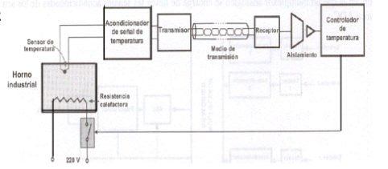

## Clases de instrumentos

La instrumentación industrial incluye una gran variedad de instrumentos (de medición y control) por lo que resulta conveniente clasificar los mismos para facilitar su estudio y comprensión.

En el presente se considerarán dos clasificaciones fundamentales:

- Atendiendo a la función del instrumento.
- Relacionada con la variable del proceso.

### De acuerdo con la función del instrumento

#### Instrumentos ciegos

Son aquellos que no tienen indicaci?n visible de la variable. A este grupo pertenecen los instrumentos de alarma, los transmisores o receptores sin indicación.

#### Instrumentos indicadores

Disponen de un índice y una escala graduada en los analógicos o de indicación numérica en los digitales en los que puede leerse el valor de la variable medida

##### Ejemplo 1

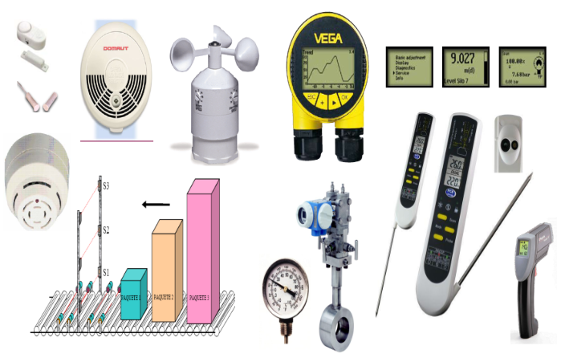

#### Instrumentos registradores

Registran con trazo continuo o de puntos la variable. Pueden ser de forma circular, de gráfico rectangular o continuo.

#### Elementos primarios

Están en contacto con la variable a medir y utilizan o absorben energía del medio medido.

##### Ejemplo 2

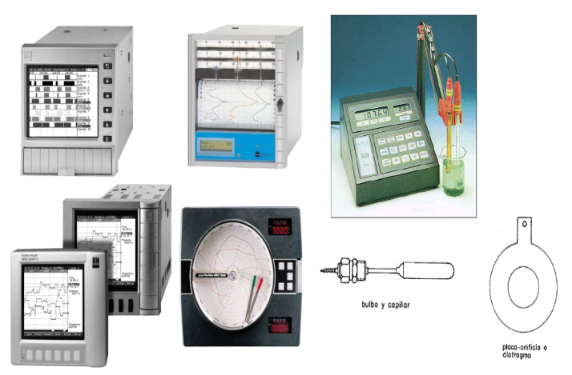

#### Transmisores

Captan la variable de proceso a través del elemento primario y la transmiten una distancia. La señal transmitida puede ser neumática o eléctrica.

#### Transductores

Reciben una señal de entrada función de una o más cantidades físicas y la convierten, modificada o no, en una señal de salida.

#### Convertidores

Reciben una señal neumática (20-100 KPa) o eléctrica (4-20 mA) y la modifica a una señal estándar de corriente o neumática.

##### Ejemplo 3

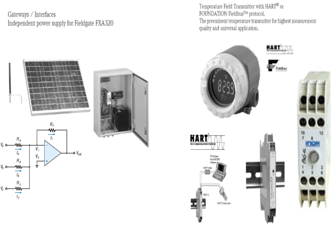

#### Receptores

Reciben las señales procedentes de los transmisores y la indican o la registran.

#### Controladores

Comparan la variable controlada con el valor deseado (referencia, punto de consigna) y ejercen una acción correctiva de acuerdo con la desviación (señal de error).

#### Elemento final de control

Recibe la señal del controlador (acción de control) y actúa sobre una variable del proceso (señal manipulada) modificando las condiciones de operación del mismo.

##### Ejemplo 4

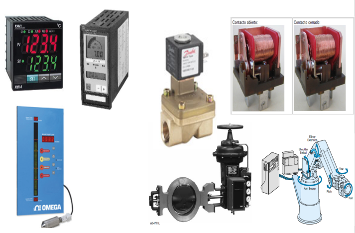

### Relacionada con la variable del proceso

#### Instrumentos de caudal, presión, nivel, densidad, temperatura, pH, tensión eléctrica, etc

Esta clasificación se refiere al tipo de las señales medidas y es independiente del sistema empleado en la conversión de la señal del proceso.

Así mismo, esta clasificación es independiente del número y tipo de transductores existentes entre el proceso (es decir, la variable medida) y el instrumento final

---

Entonces, en la designación de un instrumento cualquiera, generalmente se podrá utilizar las dos clasificaciones expuestas:

- Atendiendo a la función del instrumento.
- Relacionada con la variable del proceso.

::: tip Ejemplo
Se referirá a un **transmisor ciego de presión** o un **controlador registrador de temperatura** o un **receptor indicador de nivel**.
:::

## Metrología

Ciencia que tiene por objeto de estudio las medidas de las magnitudes, las unidades y las exigencias técnicas de los métodos e instrumentos de medida

### ¿Por qué puede fracasar la automatización de un proceso?

- Si los sistemas de medición entregan información falsa
- Si la información es correcta y se toman malas decisiones por los sistemas inteligentes
- Si la toma de decisiones es correcta y el sistema de accionamiento ejecuta mal su actividad

#### ¿Qué hacer desde la medición?

La continua y sistemática actividad metrológica sobre la instrumentación industrial es la que permite explotar correctamente el equipamiento y evitar así el fracaso en las inversiones.

La medición es el proceso mediante el cual se halla experimentalmente la relación numérica entre la magnitud sujeta a medición y la unidad de medida correspondiente, es decir, cuántas veces la magnitud es mayor o menor que la unidad de medida.

### Sistemas métricos más puntuales

- Sistema CGS.
- Sistema MKS.
- Sistema técnico europeo.
- Sistema técnico inglés.
- Sistema internacional de unidades (SI).

#### Sistema CGS

| Magnitudes Fundamentales | Unidades |
| ------------------------ | -------- |
| Longitud (L)             | cm       |
| Masa (m)                 | g        |
| Tiempo (t)               | s        |

#### Sistema MKS

| Magnitudes Fundamentales | Unidades |
| ------------------------ | -------- |
| Longitud (L)             | m        |
| Masa (m)                 | kg       |
| Tiempo (t)               | s        |

#### Sistema técnico inglés

| Magnitudes Fundamentales | Unidades   |
| ------------------------ | ---------- |
| Longitud (L)             | Pie(ft)    |
| Masa (m)                 | Libra (lb) |
| Tiempo (t)               | s          |

#### Sistema internacional de unidades

Este sistema de medida fue adoptado internacionalmente en la XIII y XIV Conferencia General de Pesos y Medidas que tuvieron lugar en París en 1967 y 1971 y ratificado en la III Conferencia General de la Organización Internacional de Metrología Legal.

El SI ha sido adoptado en los años subsiguientes mediante la promulgación de Leyes, Decretos, etc., por un número creciente de países y en la actualidad se puede exigir a prácticamente cualquier fabricante que los instrumentos que suministre expresen la medición en este sistema.

| Magnitudes Fundamentales | Unidades      |
| ------------------------ | ------------- |
| Longitud (L)             | metro(m)      |
| Masa (m)                 | kilograme(kg) |
| Tiempo (t)               | segundo(s)    |
| Corriente Eléctrica      | Ampere(A)     |
| Intensidad lumínica      | candela(cd)   |
| Cantidad de sustancia    | mole(mol)     |

## Código de identificación de instrumentos

Para la designación y representación de los instrumentos de medición y control se emplean normas muy variadas que a veces varían de industria a industria.

La Sociedad de Instrumentos de Estados Unidos, ISA (International Society of Automation), ha dedicado grandes esfuerzos a la normalización universal para establecer sistemas de designación de aplicación a las industrias químicas, petroquímicas, aire acondicionado, etc.

### Norma ISA

1. #### Cada instrumento debe identificarse con sistema de letras que lo clasifique funcionalmente

   - **Primeras letras** Identifican la variable medida por el instrumento
   - **Letras sucesivas** Referida a la función que realiza el instrumento
   - Los lazos de instrumentos se identifican con una secuencia de números que puede comenzar por el 1 o por cualquier número que incorpora información del área de la planta a que pertenece el lazo (ejemplo: el lazo 401 puede significar que pertenece al área 4).

2. #### El número de letras funcionales para un instrumento debe ser mínimo, no excediendo de cuatro. Para ello conviene

   - Disponer de letras en subgrupos.
     Ejemplo: Un transmisor registrador de relación de caudales con un interruptor de alarma de relación de caudales puede identificarse con dos círculos: uno con FFRT-3 y el otro FFS-3.
   - En un instrumento que indica y registra la misma variable medida puede omitirse la letra I (indicación)
   - Los lazos de instrumentos de un proyecto o secciones de un proyecto deben identificarse con una secuencia única de números. Esta puede empezar con 1, 201, 1201, etc. Estos números pueden incorporar información codificada tal como el área de la planta.
   - Si un lazo dado tiene más de un instrumento con la misma identificación funcional, es preferible añadir un sufijo.
     Ejemplo: FV-2A, FV-2B, FV-2C o TE-25-1, TE-25-2, etc.
   - Los sufijos también deben obedecer algunas reglas como:
     - Deben emplearse letras mayúsculas.
     - En un instrumento tal como registrador de temperatura multipunto que imprime números para identificación de los puntos, los elementos primarios pueden numerarse TE-25-1, TE-25-2, TE-25-3, etc.
     - Las subdivisiones interiores de un lazo pueden designarse con letras y números.

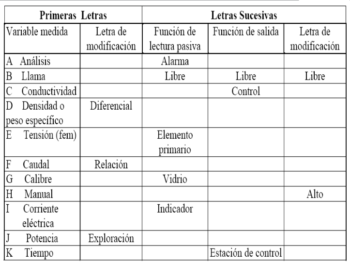
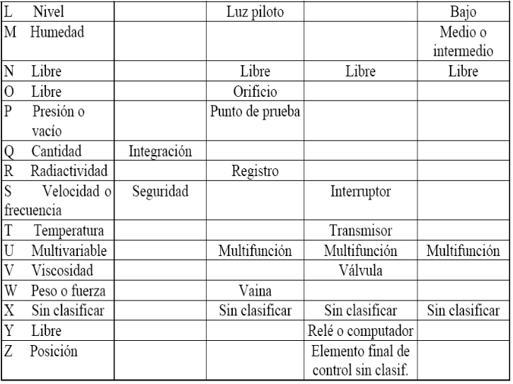

#### Notas

- Las letras clasificadas como "Libre" pueden emplearse para una designación no clasificada que se repita en un proyecto.

- La letra X puede emplearse en una designación no clasificada que se utilice una vez o pocas veces en un proyecto.

- La letra U puede emplearse para agrupar varias variables o funciones o puede emplearse una combinación de letras.

#### Ejemplos

- Un instrumento designado como TIR-201 será un registrador indicador de temperatura del lazo 201.

- Un instrumento designado como FFT-304 será un transmisor de relación de flujo del lazo 304.

- Un instrumento designado como PE-102 será un elemento primario de presión del lazo 102.

- Un instrumento designado como LSAH-403 será un interruptor con alarma por valor alto de nivel del lazo 403.

- Un instrumento designado como YC-112 será un controlador de una variable no prevista en la clasificación del lazo 112.

- En este caso es recomendable especificar al lado del símbolo en el plano la variable, por ejemplo pH.

En el plano el símbolo general que se utiliza para representar los instrumentos es la circunferencia de diámetro aproximado 11,1 mm.

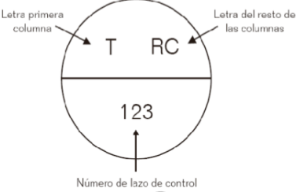

El instrumento local, o sea, los instrumentos instalados en el campo, se simbolizan con el círculo con el código que identifica al instrumento en su interior, o sea, las letras que lo identifican y el lazo a que pertenece.

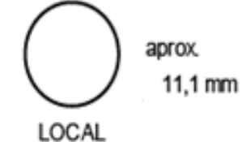

El instrumento montado en panel, se simboliza por el círculo dividido horizontalmente por su diámetro, situándose las letras de identificación en el semicírculo superior y el lazo a que pertenece en el semicírculo inferior.

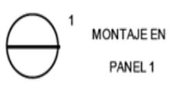

Para los instrumentos montados por detrás del panel, la división horizontal del círculo se hace con línea discontinua.

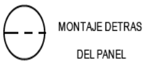

#### Tabla normas ISA

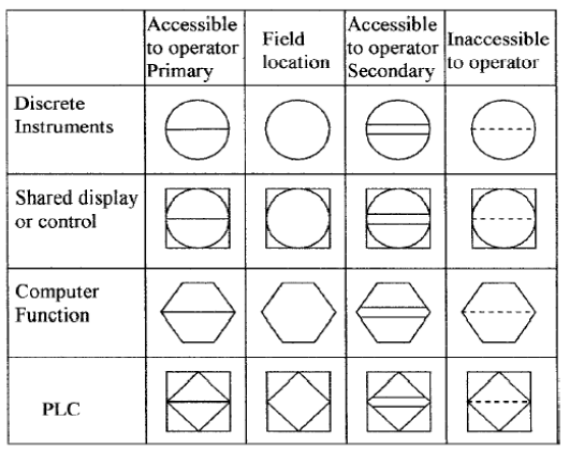

### Tipos de conexiones normas ISA

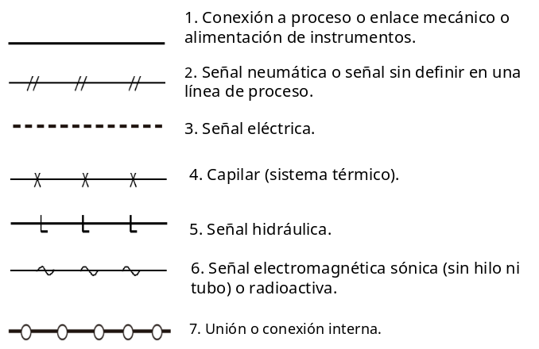

## Habilidades a lograr con el contenido de mediciones

- Definir los elementos principales de la instrumentación.
- Definir los componentes de los sistemas de medición y explicar sus características.
- Clasificar los instrumentos de medición.
- Enunciar nociones básicas sobre metrología.
- Clasificar los sistemas de medida enunciando sus unidades.
- Identificar y reproducir la normas internacionales usadas para representar los instrumentos.

### Ejemplo normas ISA

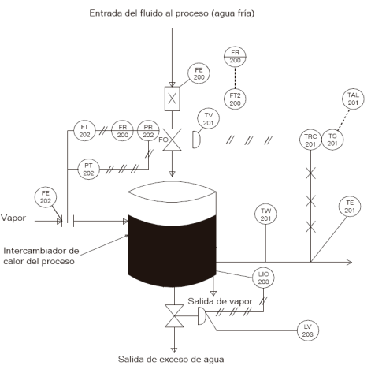

::: tip Opcional
Identifique los elementos del diagrama con ayuda de la [tabla](./#tabla-normas-isa) y el [listado de letras empleadas](./#codigo-de-identificacion-de-instrumentos)
:::
