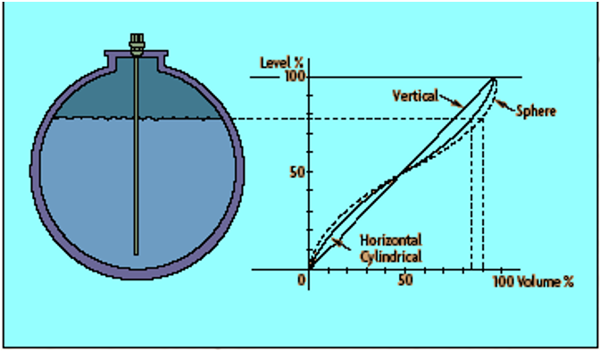
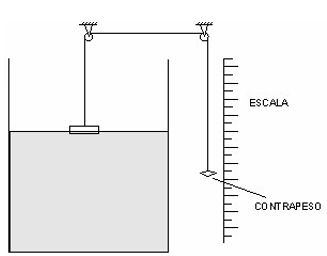
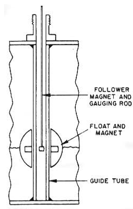
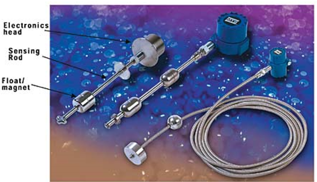
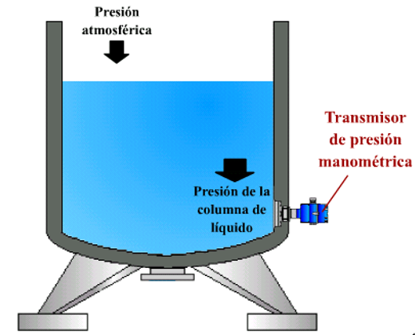
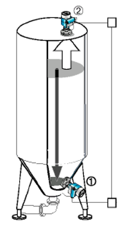
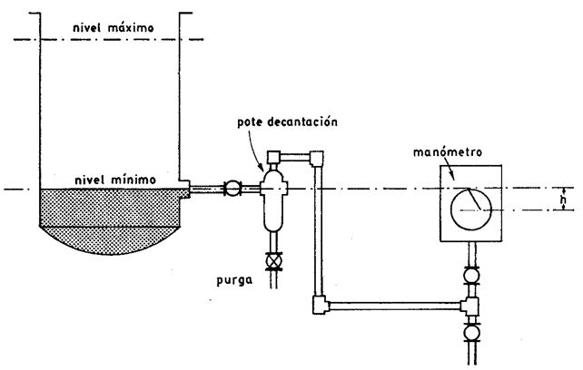
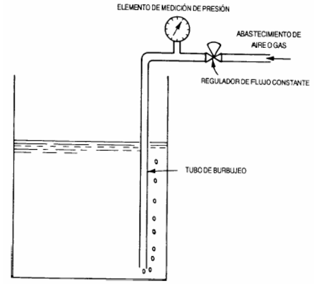
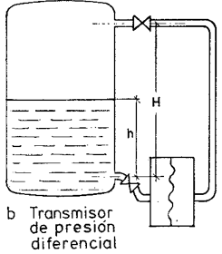

# Medición de nivel

La medición de nivel es muy importante en las industrias y en algunas de ellas, es indispensable.

En la selección correcta de un instrumento para la medición de nivel, intervienen en mayor o menor grado los siguientes factores: el campo de medida, la naturaleza del fluido que va a ser medido y las condiciones de operación.

Deben distinguirse dos situaciones totalmente diferenciadas en la medición de nivel: la medición de nivel en líquidos y la medición de nivel en sólidos.

## Condiciones de trabajo

Los instrumentos medidores de nivel realizan sus funciones en condiciones disímiles:

- Bajo presión.
- En vacío.
- A bajas temperaturas o a muy altas temperaturas.

Existen más de 300 tipos diferentes de sensores de nivel.

## Características de la variable nivel

La medición de nivel en los líquidos no solo resulta con la expresión numérica de la distancia entre la línea base y la superficie del líquido.

En la mayoría de las ocasiones es necesario expresar esta distancia o altura en unidades de longitud, en unidades de volumen o en unidades de masa del líquido.

Relación entre el nivel y el volumen de un tanque

## Clasificación de los instrumentos medidores de nivel

| Mediciones directas                         | Mediciones indirectas                        | Principio de medición                                                                |
| ------------------------------------------- | -------------------------------------------- | ------------------------------------------------------------------------------------ |
| De sonda                                    | Mediante la presión hidrostática             | Manométrico, de membrana, de tipo de burbujeo, de diafragma, de presión diferencial. |
| De cinta y plomada                          | Por el empuje en un flotador.                | De desplazamiento a barra de torsión.                                                |
| Nivel de cristal e instrumentos de flotador | Por las características físicas del líquido. | Resistivo, conductivo, capacitivo, ultrasónico, de radiación, de láser               |

### Medidor de sonda

Consiste en una varilla o regla graduada de la longitud conveniente para introducirla en el depósito.

La determinación del nivel se efectúa por la lectura directa de la longitud mojada de la regla por el líquido. En el momento de la lectura el tanque debe estar abierto a presión atmosférica.

**Características:**

- Resulta imprescindible que el líquido “moje” a la regla graduada.
- Se utilizan generalmente en tanques de fuel-oil o gasolina.
- La regla debe mantenerse perpendicularmente durante la medición.

Otro medidor consiste en una varilla graduada, con un gancho que se sumerge en el seno del líquido y se levanta después hasta que el gancho rompe la superficie del líquido.

La distancia desde esta superficie hasta la parte superior del tanque representa indirectamente el nivel.

Se emplea generalmente cuando existen dificultades prácticas para la manipulación del medidor de sonda.

    Ejemplo: un tanque grande en un local techado, donde no quede espacio para introducir la regla graduada.

Su principio es similar al medidor de sonda.

### Nivel de cristal

Consiste en un tubo de vidrio con sus extremos conectados a bloques metálicos, cerrados por prensaestopas, unidos al tanque generalmente mediante tres válvulas, dos de cierre de seguridad en los extremos del tubo y una de purga.

- El nivel de cristal convencional se emplea para presiones hasta 7 kg / cm2.
- A presiones más elevadas el cristal es grueso, de sección rectangular y está protegido por una armadura metálica.

Lectura del nivel

La lectura del cristal se realiza o bien por reflexión o bien por transparencia.

El vidrio en contacto con el líquido está provisto de ranuras que actúan como prismas de reflexión indicando la zona del líquido con un color oscuro y la del vapor con un color claro.

Es empleada para precisar el color característico de interfase del líquido.

El líquido se encuentra contenido entre dos placas de vidrio planas y paralelas que permiten ver directamente el nivel, mejorándose la apreciación visual al acoplar una lámpara de iluminación al sistema.

Su principal ventaja es que ofrece gran seguridad en la lectura, puede utilizarse como control de otros sensores y trabaja bajo presión.

**Desventajas:**

- Los niveles de cristal son susceptibles de ensuciarse por las características de los líquidos que miden (caramelo, y otros líquidos pegajosos).
- Solo permite una indicación local, aunque en casos especiales la indicación puede ser transmitida a largas distancias empleando cámaras de televisión o sistemas de espejos.

### Instrumentos de flotador

Consiste en un flotador ubicado en el seno del líquido y conectado al exterior del tanque indicando directamente el nivel sobre una escala graduada.

Hay que señalar que en estos instrumentos, el flotador puede tener formas muy variadas y estar formado por materiales muy diversos según sea el tipo de fluido.

La conexión puede ser:

- Magnética.
- Hidráulica.
- Directa.

#### Flotador conectado directamente

Está unido por un cable que desliza en un juego de poleas a un índice exterior o puntero que señala sobre una escala graduada la indicación de la lectura.

Es el modelo más antiguo y el más utilizado en tanques de gran capacidad tales como los de fuel oil y gas oil.

#### Flotador acoplado magnéticamente

Dentro del tubo una pieza magnética sigue al flotador en su movimiento y mediante un cable y un juego de poleas arrastra al índice del instrumento situado en la parte superior del tanque.
El instrumento puede tener transmisor eléctrico o neumático.

#### Flotador acoplado hidráulicamente

Actúa en su movimiento sobre un fuelle de tal modo que varía la presión en el circuito hidráulico y señala la distancia en el receptor el nivel correspondiente.

Permite distancias de transmisión hasta de 75 m y puede emplearse en tanques cerrados.

**Ventajas:**

- Tienen una precisión de 0.5%.
- Se aplican en tanques abiertos y cerrados a presión o a vacío.
- Trabajan independientemente de la densidad del líquido.

**Desventajas:**

- Necesita de calibración y montaje complicados.
- Tiene partes móviles en contacto con el líquido que se deterioran con el funcionamiento.
- El flotador puede interrumpir su movimiento por un eventual depósito de sólidos y de cristales que acompañan a los líquidos.
- Los tubos guías muy largos pueden dañarse ante las olas bruscas que se forman en la superficie del líquido.

### Medidores basados en la presión hidrostática

Este método se basa en la medición de la presión hidrostática correspondiente a una columna de líquido de una altura determinada.

$P = h*\rho*g$

Donde:

$P$ = presión

$h$ = altura

$g$ = aceleración de a gravedad

$\rho$ = densidad relativa

Si la densidad del medio es constante, la única variable es h. Así, la presión es directamente proporcional a la altura h, es decir, al nivel del líquido en el tanque.

En la siguiente figura, la presión hidrostática de la columna de líquido se mide directamente con un transmisor de presión o de presión diferencial.

La medición de nivel con transmisor de presión se utiliza preferentemente en tanques abiertos expuestos a la atmósfera. En estos casos, la presión medida es igual a la presión de la columna de líquido + la presión atmosférica (presión en la superficie). La presión en la superficie suele ser despreciable porque la mayoría de los sensores de presión disponen de dispositivos que compensan la presión atmosférica. Para estos casos, los transmisores se montan en la parte más baja del tanque. Si el sensor no se puede montar directamente en el lateral del tanque al nivel adecuado, se puede montar en el extremo de una barra o cable y bajarlo desde la parte superior del tanque hasta la profundidad oportuna.

Cuando la presión de la superficie del líquido es mayor que la presión atmosférica (tanques cerrados-presurizados), se puede emplear un sensor de presión diferencial, el cual mide por un lado la presión total ejercida al fondo del tanque, y por otro lado la presión en la superficie. La presión de la superficie se resta de la presión total, quedando la presión correspondiente a la columna de líquido. La medición de presión diferencial requiere de dos sensores, pero también se puede llevar a cabo directamente con una célula de medición de presión diferencial

### Medidores manométricos

Consiste en un manómetro conectado directamente a la parte inferior del tanque.

Consta de varias partes fundamentales:

- La válvula para el cierre durante el mantenimiento.
- Un pote de decantación con una válvula de purga.
- El manómetro.

El manómetro mide la presión debida a la altura de líquido h que existe entre el nivel del tanque y el eje del instrumento.

Como las alturas son limitadas, el rango de medida es bastante pequeño, de modo que el manómetro utilizado tiene un elemento de medida del tipo fuelle.

El instrumento sólo sirve para fluidos limpios ya que si el líquido es corrosivo, coagula o bien tiene sólidos en suspensión, el fuelle puede destruirse o bien bloquearse perdiendo su elasticidad; por otra parte, como el rango de medida es pequeño no es posible utilizar sellos de diafragma. La medida está limitada a tanques abiertos y el nivel viene influido por las variaciones de densidad del líquido.

**Desventajas:**

Este tipo de instrumento no puede utilizarse para líquidos con características corrosivas, ni con sólidos en suspensión, solo para líquidos limpios.

- La distancia entre el tanque y el manómetro debe ser limitada.
- La medida está limitada a tanques abiertos.

### Medidores de membrana

Utiliza una membrana conectada con un tubo estanco al instrumento receptor.
Es empleado en tanques abiertos.
La fuerza ejercida por la columna de líquido sobre el área de la membrana comprime al aire interno a una presión igual a la ejercida por la columna de líquido.

**Características:**

- El volumen del aire interno es relativamente grande, por lo cual el sistema está limitado a distancias no mayores de unos 15 m, debido a la compresibilidad del aire.
- La presión máxima que el líquido ejercerá es de $\dfrac{h*\rho}{10 kg/cm^2}$.
- Su precisión es de 1%, puede trabajar a temperaturas de 60°C.

**Desventajas:**

- Es frágil y delicado.
- Cualquier pequeña fuga del aire influirá negativamente en la calibración del instrumento.
- No se puede utilizar en líquidos corrosivos.
- En aquellos líquidos que contienen sólidos en suspensión es necesario conectar una tubería de purga en la parte inferior de la membrana para permitir la limpieza periódica del instrumento.

#### Consideraciones prácticas a tener en cuenta para la utilización de los medidores de membrana.

- Seleccionar los materiales de la caja y de la membrana tales que no reaccionan con el líquido que se mide.
- Seleccionar las dimensiones correctas de la caja y de las tuberías, pues estas determinan los límites de transmisión de la señal en el tiempo de respuesta.
- No introducir la membrana en la profundidad del líquido si la conexión con el aire o el manómetro está interrumpida.
- Si la temperatura del líquido excede la de trabajo del material de la membrana entonces será necesario hacer una conexión externa de la misma.

### Medidor de burbujeo

Emplea un tubo sumergido en el líquido (hasta el nivel mínimo) por donde se hace burbujear aire mediante un rotámetro con un regulador de caudal incorporado, hasta producir una corriente continua de burbujas.

La presión de aire en la tubería equivale a la presión hidrostática ejercida por la columna del líquido, es decir por el nivel.

Mediante un regulador de caudal se hace pasar por un tubo (sumergido en el deposito hasta el nivel mínimo), un pequeño caudal de aire o gas inerte hasta producir una corriente continua de burbujas. La presión requerida para producir el flujo continuo de burbujas es una medida de la columna de líquido.
Este sistema es muy ventajoso en aplicaciones con líquidos corrosivos con materiales en suspensión (el fluido no penetra en el medidor, ni en la tubería de conexión).

En este método se mide la presión hidrostática en un tanque insertando un tubo delgado en el líquido y aplicando aire comprimido en el tubo de modo que se empuja hacia abajo la columna de líquido del tubo hasta que salgan burbujas de aire al líquido. Estas burbujas dan su nombre al método. La presión del aire en el tubo es entonces igual a la presión de la columna de líquido y se puede medir con un transmisor de presión, que convierte la presión en una señal eléctrica. El aire comprimido se puede obtener a partir del conducto principal de aire mediante una válvula manoreductora o con un minicompresor.

**Características:**

- El regulador de caudal permite mantener un caudal de aire constante a través del líquido independientemente del nivel.
- Es normal un caudal de 150 $NL/h$ o 0,000024 $m^3/s$, 3 $pie^3/h$). De no mantener el caudal constante, existiría una gran diferencia entre los caudales necesarios desde el nivel mínimo y el nivel máximo, con el inconveniente de un gasto de aire innecesario.
- La tubería empleada suele ser de ½” con extremo biselado para una fácil formación de las burbujas de aire.

**Ventajas:**

- El manómetro receptor (de tipo de fuelle) puede colocarse hasta distancias de 200 m.
- Puede utilizarse aire y otros tipos de fluido. El tubo debe tener una longitud adecuada, para evitar que las variaciones bruscas del nivel introduzcan dentro del tubo una columna de líquido que retarde el paso del aire y que falsee la medición momentáneamente.
- Es simple y da buen resultado, en casos de líquidos corrosivos o con sólidos en suspensión y en emulsiones.

**Desventajas:**

- No se recomienda cuando el fluido de purga perjudica al líquido, ni para líquidos altamente viscosos donde las burbujas presentan el riesgo de no separarse rápidamente del tubo.
- Para el mantenimiento debe utilizarse una conexión tipo T en la parte superior que permita la limpieza del tubo.

**Consideraciones prácticas:**

- La presión del fluido de purga debe exceder al menos en 2 psi la presión estática de la columna del líquido.
- La presión máxima admisible para estos sistemas está cerca de los 150 psi o 300 pies de agua.
- El material de purga debe iniciarse antes de echar el líquido.
- El líquido deberá ser drenado antes de que sea apagado el fluido de purga.

### Medidor de diafragma

Consiste en un diafragma en contacto con el líquido del tanque, que mide la presión hidrostática en un punto del fondo del tanque.

En un tanque abierto esta presión es proporcional a la altura del líquido en ese punto y a su peso específico.

P=hγ

El diafragma forma parte de un transmisor neumático o electrónico de presión diferencial.

Los sistemas de caja de diafragma se usan para medir nivel en tanques abiertos cuando no se puede contar con aire o gas, o cuando el método por tubo de burbujeo no es recomendable.

El instrumento consiste esencialmente en una copa o caja recubierta con un diafragma flexible

En el tipo mas utilizado el diafragma está fijado en una brida que se monta rasante al tanque para permitir sin dificultades la medida del nivel de fluidos tales como la pasta del papel y líquidos con sólidos en suspensión, pudiendo incluso ser de montaje saliente.

**Características:**

- El nivel cero se selecciona en un eje a la altura del diafragma.
- Si el instrumento se calibra en el tanque, el 0% del aparato debe comprobarse con el nivel más bajo en el borde inferior del diafragma.
- Entre el borde inferior y el superior del diafragma la señal de salida no está en proporción directa al nivel.

### Medidor de presión diferencial

El principio de funcionamiento es similar al del medidor de nivel mediante la presión hidrostática, pues la diferencia de presión depende de la presión que el líquido ejerce.

Si el tanque no está presurizado, ésta depende principalmente de la altura del líquido por encima de la toma inferior.
En el caso de que el tanque esté cerrado y bajo presión hay que corregir la indicación del aparato para la presión ejercida sobre el líquido (debiendo señalar que la lectura será menos precisa, si la presión es grande).

Cuando los gases o vapores encima del líquido son condensables, la línea desde la toma superior se llena gradualmente con el condensado hasta llenar todo el tubo, en cuyo caso la tubería de la derecha del transmisor tendrá mayor presión que la tubería izquierda.

**Características:**

En tanques cerrados y a presión con líquido de vapor condensable existe el riesgo de obturación de la línea de compensación en particular si el fluido no es limpio.

Para evitarlo puede purgarse la línea con líquido o gas, método que no se recomienda por mantenimiento y la posible pérdida de precisión que presenta o bien emplear un transmisor de presión diferencial unido con dos capilares a dos diafragmas conectados en las partes inferior y superior del tanque.

**Aplicación:**

Una de las aplicaciones de los medidores de presión diferencial son los domos de los generadores de vapor.

Dentro del domo de la caldera está situado el tubo que termina en el colector del condensado.

El tubo estará siempre lleno de agua por lo que estará a nivel constante y se encuentra conectado con la cámara de alta presión del manómetro diferencial.

Cerca del fondo del domo sale otro tubo que viene a conectarse con la cámara de baja presión del manómetro.

El recorrido de ambos tubos desde el domo hasta el manómetro se hace conectándose con abrazaderas metálicas para tratar la temperatura del agua de ambas columnas.

De esta manera la densidad de el agua es igual en las dos ramas de conexión y se minimiza el error.

::: tip Tarea

- Realice una búsqueda de modelos y fabricantes de los medidores de nivel analizados en la conferencia.

- Investigue aplicaciones de los medidores de nivel que basan su funcionamiento en la presión hidrostática.
  :::
