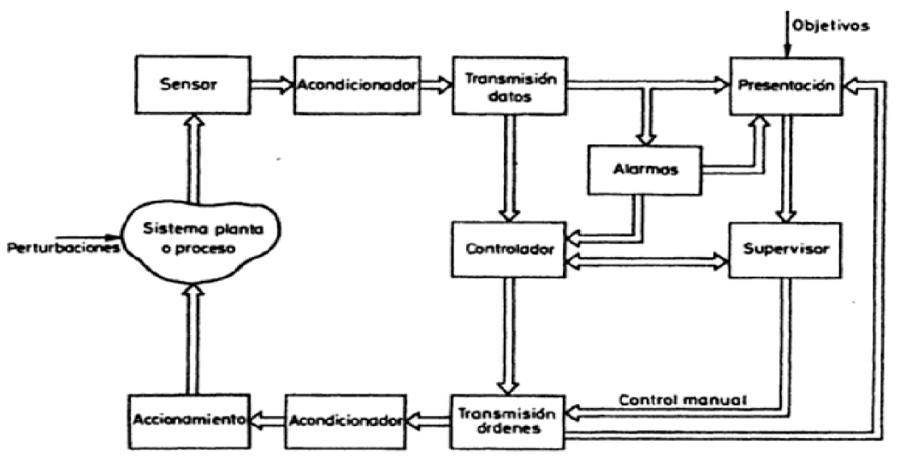
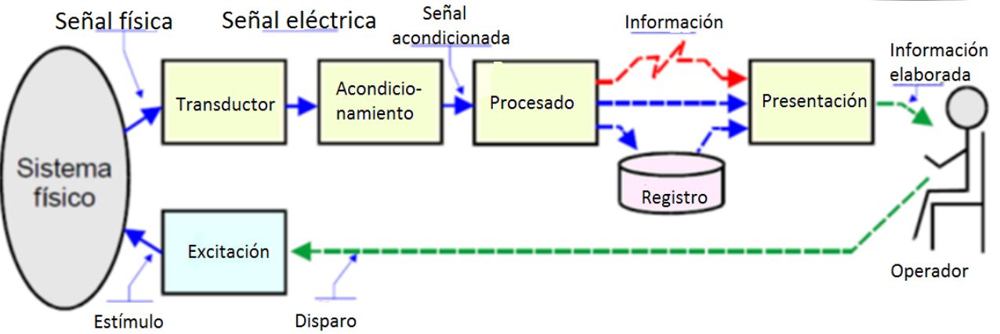
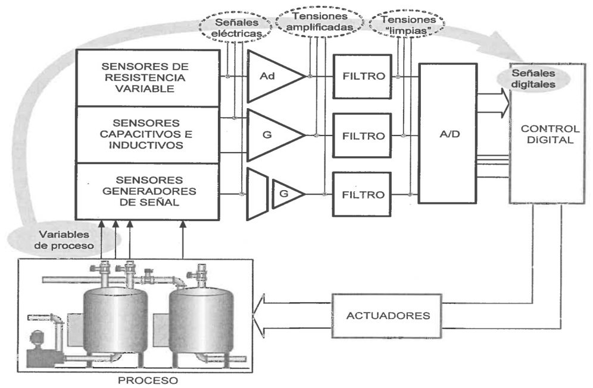
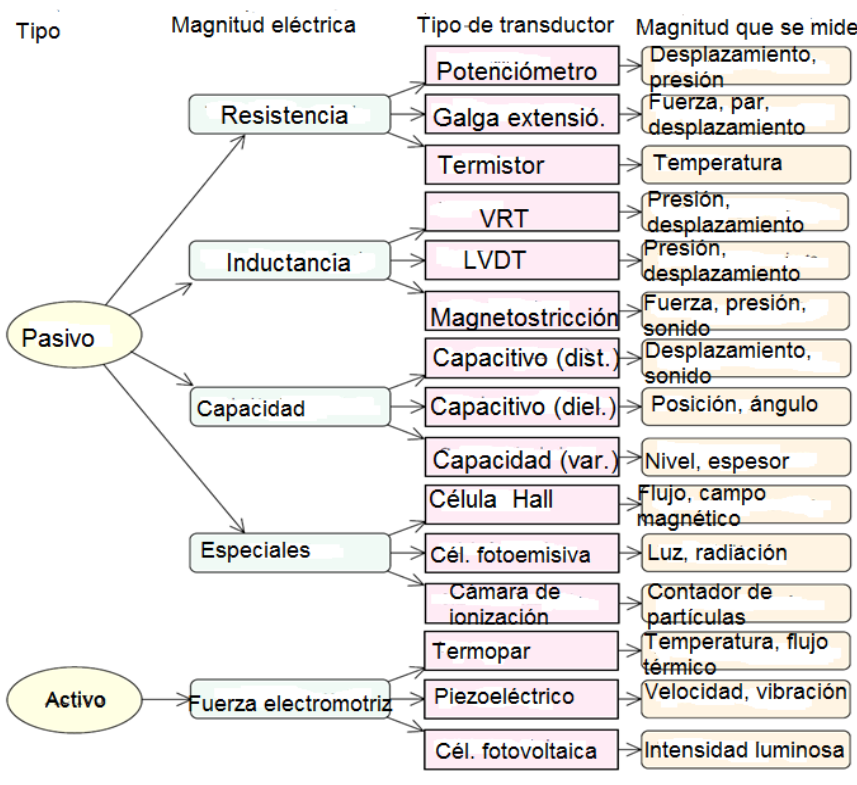

# Sistemas de medición

Los sistemas de control y medición pueden tener estructuras como las que se muestran a continuación

En un proceso pueden haber múltiplas variables medidas y cada una puede tener su lazo de control, por ejemplo:

En la figura anterior se puede apreciar como del proceso se pueden medir diferentes variables (Ej.: temperatura, presión, nivel, concentración, pH, etc...), y para las mismas se utilizan sensores de diferentes tipos que nos pueden dar salidas de diferentes formas, las cuales son amplificadas, filtradas y luego convertidas a señales digitales, empleando conversores A/D.

El sistema luego con las señales digitales, es capaz de hacer una toma de interpretar el estado del proceso y emitir acciones de control sobre el mismo, influenciando los actuadores.

A continuación se presentan ejemplos de algunas magnitudes físicas y el tipo de elemento que se emplea para poder cuantificar la misma

## Transductor

El transductor es el componente que convierte la magnitud física a medir, en una señal eléctrica

En este componente se puede diferenciar entre el sensor, que es el elemento sensible primario que responde a las variaciones de la magnitud que se mide, y el transductor que es el que lleva acabo la conversión energética entre la magnitud de entrada y de salida

## Acondicionamiento de la señal

Este bloque incluye todas aquellas transformaciones que deben realizarse sobre señales eléctricas que resultan en la salida del transductor, y que son previas al procesado para extraer la información que se mide o evalúa.

Cuando el tipo de señal eléctrica que proporciona el transductor no es una tensión, se utiliza un convertidor desde el tipo de señal de que se trate, a tensión.

La señal debe ser acondicionada para incrementar la relación señal ruido hasta niveles adecuados. Este tipo de acondicionamiento implica: Amplificar y Filtrar

Cuando el procesamiento de la señal es digital, el acondicionamiento corresponde a la conversión Analógica/Digital.

## Procesamiento de la señal

Incluye el conjunto de transformaciones a que debe ser sometida la señal eléctrica a fin de extraer de ella, la información que se busca. El procesamiento de la señal suele contener muy diversas operaciones, ya sean lineales, no lineales, de composición de múltiples señales, o de procesado digital de las señales.

## Registro de la señal

Consiste en el almacenamiento permanente o temporal de las señales para su posterior análisis o supervisión. Esta operación es necesaria si el flujo de información que se adquiere supera la capacidad de procesamiento de que se dispone. Su naturaleza puede ser papel, magnética, óptica, electrónica, etc.

## Telemetría

En casos, cuando es necesario transmitir la señales entre la captación y el procesamiento mediante un canal de comunicación. Para adaptar las señales a las características de canal de comunicación es necesario introducir procesos de modulación, demodulación o codificación apropiados.

## Presentación de la información

La información resultante del proceso de medida debe ser presentada de forma comprensible al operador, o elaborada e integrada para que pueda ser interpretada por un sistema supervisor automático.
