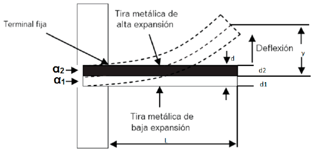

# Medidores de temperatura

**Temperatura:** Es una variable de gran importancia en la industria, esta es empleada para detectar cambios del estado físico (fases), que tienen las sustancia que intervienen en un proceso.

Este cambio se logra mediante la aplicación o pérdida de calor y se mide, registra y principalmente se controla para obtener un óptimo resultado en los productos de un proceso.

**Temperature** is a measure of the thermal energy in a body, which is the relative hotness or coldness of a medium and is normally measured in degrees using one of the following scales; Fahrenheit (F), Celsius or Centigrade (C), Rankine (R), or Kelvin (K) (Dunn, 2005).

## Escalas de medición de temperatura

Las escalas de temperatura están basadas en el hecho en el cual el punto de fusión del hielo y el punto de ebullición del agua, ocurre a cierta temperatura, a la presión de una atmósfera al nivel del mar (10.13\*104 Pa).

- Celsius (centígrados)
- Fahrenheit
- Kelvin
- Rankin

### Escala práctica internacional de temperatura (EPIT)

| Puntos de medición                                                                                    | Temperatura ºC |
| ----------------------------------------------------------------------------------------------------- | -------------- |
| Temperatura del estado de equilibrio en una mezcla de oxígeno líquido y gaseoso (punto de ebullición) | -182,96 ºC     |
| Punto de congelación del agua                                                                         | 0,00           |
| Punto de ebullición                                                                                   | 100,00         |
| Punto de solidificación de la plata                                                                   | 960,3          |
| Punto de solidificación del oro                                                                       | 1063,0         |

| Tipo de escala | Punto de ebullición del agua | Punto de fusión del hielo | Cero absoluto |
| -------------- | ---------------------------- | ------------------------- | ------------- |
| EPIT           | 100                          | 0                         | -273.16       |
| Farenheit      | 212                          | 32                        | -459.7        |
| Kelvin         | 373.16                       | 273.16                    | 0             |
| Ranking        | 671.7                        | 459.7                     | 0             |

### Equivalencias entre las escalas

$K = C + 273.16$
donde:
C = temperatura en °C
K = temperatura en Kelvin.

$F = \dfrac{9}{5}\degree C + 32$

donde:

F = temperatura en °F.

$R = F + 459.67$

donde:

R = temperatura en °R.

## Aplicaciones industriales

- Casas, oficinas.
- Producción de plástico, medicinas herramientas.
- Plantas químicas, alimenticias, nucleoeléctricas, hidroeléctricas.
- Explotación y refinación del petróleo.

## Transmisión de calor

### Conducción

Se produce al calentar un extremo de una barra metálica, los átomos o moléculas adquieren una mayor energía de agitación, pues parte de esta energía se transfiere a las partículas adyacentes, y luego la temperatura de esta región también se calienta.

Este proceso continúa a lo largo de la barra y después de cierto tiempo, el otro extremo percibirá una elevación de la temperatura, por tanto, hubo una transmisión de calor a lo largo de la barra.

La mayor parte del calor se transfiere a través de los cuerpos sólidos.

Dependiendo de la constitución atómica de una sustancia, la agitación térmica podrá transmitirse de un átomo a otro con mayor o menor facilidad, haciendo que esta sustancia se buena o mala conductora de calor.

| Buen conductor | Malos conductores         |
| -------------- | ------------------------- |
| Metales        | Corcho, porcelana, madera |

### Convección

Cuando un recipiente con agua es calentado, el agua del fondo recibe calor por conducción. Con el calentamiento, el volumen de esta capa aumenta, y por tanto su densidad disminuye, haciendo que el agua se desplace hacia la parte superior y que el agua más fría más densa se mueva hacia el fondo. El proceso continúa con una circulación de masas, movimientos que se denominan corrientes de convección.

Así el calor que se transmite por conducción a las capas inferiores, se va distribuyendo por convección a toda la masa del líquido, mediante el movimiento de traslación del propio líquido.

La transferencia de calor en los líquidos y gases puede efectuarse por conducción, pero la mayor parte del calor que se transmite a través de los fluidos se debe al proceso de convección.

### Radiación

Si se coloca un foco eléctrico en el interior de una campana de vidrio al vacío, y se pone un termómetro en su exterior. Se indicará una elevación de la temperatura, existiendo una transmisión de calor a través del vacío del cuerpo caliente al exterior.

La transmisión se lleva a cabo mediante la radiación térmica. Todos los cuerpos calientes emiten radiaciones térmicas que pueden ser absorbidas por algún cuerpo, aumentado su temperatura.

## Clasificación de instrumentos por método de detección

Los sensores de temperatura, generalmente se clasifican por el método de detección.

- Los **termómetros**, se emplean en la conducción y convección del calor. (Instrumento en contacto directo)
- Los **pirómetros** se emplean en la medición de la radiación del calor. (Instrumento a cierta distancia)

### Tipo de elemento a emplear según el tipo de medición a realizar

- Cambios en la densidad: termómetro con líquido encapsulado de vidrio.
- Cambios en longitud o volumen: elementos bimetálicos, sistemas llenos.
- Generación de tensión en la unión de dos metales: termopares.
- Cambios en la resistencia eléctrica de los metales: termómetros de resistencia, termistores y medidores de esfuerzo.
- Radiación producida por una sustancia: pirómetros.

## Rangos de medición de temperatura

El rango de un instrumento es uno de los factores que debe tenerse en cuenta para un problema de medición de temperatura.

Además de la sensibilidad, exactitud, velocidad de respuesta, vida útil esperada, costo disponibilidad, resistencia a la corrosión y vibración, etc.

## Clasificación de los medidores de temperatura

## Termómetros

Al grupo de Termómetros mecánicos pertenecen los siguientes instrumentos de medición de temperatura:

- Termómetros bimetálicos: Indicación local
- Termómetros de vidrio: : Indicación local
- Termómetro de bulbo y capilar: Indicación remota

### Termómetro bimetálico

Con algunas excepciones, todos los cuerpos, independientemente de que sean líquidos, sólidos o gaseosos, se dilatan cuando aumenta su temperatura, por eso es que los metales se dilatan cuando son calentados y se contraen cuando son enfriados.

::: tip Dilatación lineal
Al tomar una barra de cierta temperatura y calentarla aumentará su longitud, altura, anchura o la dimensión de cualquier otra línea que se imagine trazada en la barra.
:::

#### Tira bimetálica con metales de baja y alta expansión térmica

Suponiendo que 2 tramos rectos de metal se colocan lado con lado y se sueldan longitudinalmente la unión de los dos metales se le llama Bimetálico. Si se calientan los dos metales cambiarán su longitud de acuerdo con sus rangos individuales de dilatación térmica.

Si un metal tiene un bajo coeficiente de dilatación térmica y el otro un coeficiente relativamente alto ambos metales se estiran-dilatan a diferentes longitudes cuando la temperatura se incrementa.

Por tanto, la fuerza de uno de los metales doblará hacia su lado al que tiene una menor dilatación térmica.

Si un extremo del bimetálico se fija y no puede moverse el extremo libre se moverá hacia el lado del metal que tenga mayor coeficiente de dilatación.

Cuando se requieren mayores deflexiones pero se tienen espacios reducidos se emplea el metal enrollado en espiral o en forma helicoidal.

Para emplear alguno de estos bimetálicos como medidor un extremo se fija a la caja y en el otro extremo se instala el puntero de indicación. Al deflexionar el bimetálico el Puntero gira e indica la temperatura sobre una carátula impresa.

Este Tipo de termómetro se coloca dentro de fundas de acero inoxidable para medir la temperatura de líquidos o gases.

Normalmente se llena con un fluido de silicón para ayudar a la transferencia de calor entre el vástago y el bimetálico encapsulado.

Debido a que es difícil la conversión de su movimiento en señales neumáticas o eléctricas para transmisiones remotas, sólo se usan para indicación local.

### Los termómetros bimetálicos

- Son económicos.
- Relativamente robustos.
- De lectura y calibración fácil.
- Son también razonablemente exactos.

### Características de los Termómetros bimetálicos

- Se conocen como dilatométricos.
- Emplean la diferencia de los coeficientes térmicos de expansión de los metales y de otros materiales sólidos.
- Lo forman dos elementos metálicos.
- Pueden controlar la temperatura abriendo o cerrando contactos eléctricos (relevadores térmicos).
- Poseen clase de precisión de 0.5 a 1.5%
- Miden intervalos de temperatura de -200 a 500° C.
- No presentan engranajes y no hay rozamiento.
- No necesitan de mantenimiento. Solo requieren de ajuste de cero.
- Presentan problemas de histéresis.

### Aplicaciones de los Termómetros bimetálicos

Los medidores bimetálicos son muy empleados como elementos combinados de medición y control de temperatura, principalmente en sistemas de tipo “on-off”. Ejemplo de ello son los termostatos.

Otro campo de aplicación de estos dispositivos es en la rama de las protecciones eléctricas sirviendo como interruptores de corte por sobrecorriente.

### Termómetro de vidrio

Se basan en la variación de volumen de la sustancia termométrica producto del cambio de la temperatura a presión constante.

De acuerdo al líquido termométrico empleado, varía el campo de medida del instrumento:

| Material     | Rango de medida |
| ------------ | --------------- |
| mercurio     | -35 a 280 °C    |
| mercurio-gas | -35 a 450 °C    |
| pentano      | -200 a 20 °C    |
| alcohol      | -110 a 50 °C    |
| tolueno      | -70 a 100 °C    |

Comúnmente se construyen de dos tipos: de inmersión parcial o completa.

Los instrumentos de inmersión completa han sido calibrados para realizar una correcta lectura cuando la columna de líquido se encuentra sumergida completamente en el fluido cuya temperatura se desea medir.

Los termómetros de inmersión parcial son calibrados para que solo una parte de la columna sea sumergida. Esta porción se señala con una marca en el instrumento. Son menos precisos que los anteriores.

### Características de los termómetros de vidrio

- Clase precisión puede alcanzar el 0.01%, mientras que para los termómetros industriales la clase de precisión se encuentra entre 0.5 y 1%.
- Construcción sencilla, barata, fiable y de alta precisión.
- No pueden ser usados para medir altas temperaturas.
- Son frágiles.
- Su indicación es local.

### Termómetros de bulbo y capilar (manométricos)

Consiste en un bulbo que contiene un fluido termométrico conectado por un capilar a una espiral de expansión elástica.

Cuando la temperatura del bulbo varía, el líquido o gas en el bulbo se expande y la presión de todo el sistema cambia y por consiguiente el tubo elástico del indicador de presión se deforma desplazando la aguja frente a la escala del instrumento.

Dependiendo del relleno el capilar, estos termómetros se agrupan en clases:

- Clase I : Termómetros actuados por líquido,
- Clase II : Termómetros actuados por vapor,
- Clase III : Termómetros actuados por gas.

En ocasiones se incluye una Clase IV: Termómetros actuados por mercurio, de características similares a los de Clase I.

#### Clase I

Termómetros actuados por líquido todos los elementos del sistema están rellenos por el líquido termométrico.

- La dilatación del líquido es proporcional a la temperatura por lo que la escala de los mismos es uniforme.
- El volumen del líquido depende por tanto de la temperatura del bulbo, del capilar y de la espiral, por lo que la temperatura ambiente, que puede afectar al capilar y a la espiral afectan la medición.
- Por esto, para capilares cortos (hasta 5 m) se compensa el espiral con un bimetal; esta compensación se denomina compensación en la caja y a estos instrumentos se les llama de Clase IB.
- Los líquidos utilizados son el alcohol y el éter.
- El campo de medida varía según el líquido empleado de -110 a 150 hasta 500 °C.
- Para capilares más largos, se compensa la espiral y el tubo capilar con un tubo capilar adicional cerrado y sin bulbo y una espiral adicional enrollada en sentido opuesto, rellenos ambos del líquido termométrico de modo que la influencia de la temperatura ambiente sobre el capilar y la espiral es contrarrestada. Se le llama compensación total y a estos instrumentos se les llama de Clase IA.

#### Clase II

- En los termómetros actuados por vapor, se utiliza un líquido volátil de modo que una parte del líquido termométrico pasa a la fase de vapor.
- Al subir la temperatura, aumenta la presión de vapor, el cual ejerce una fuerza sobre el líquido y ésta actúa sobre el elemento de medición (espiral).
- La variación de la presión de vapor con la temperatura no es lineal, por lo que la escala no es uniforme, sino que las divisiones aumentan en la parte más alta de la escala.
- La presión de vapor depende solamente de la temperatura del bulbo, por lo que no requieren de compensación por la temperatura ambiente.
- Si la temperatura del bulbo es mayor que la del ambiente, el capilar y el elemento de medición están llenos de líquido (Clase IIA).
- Si la temperatura del bulbo es inferior a la del ambiente, el sistema se rellena de vapor (Clase IIB).
- Campo de medida de -50 a 300 ° C.

#### Clase III

- Los termómetros actuados por gas tienen todo el sistema relleno de un gas, el cual al subir la temperatura del bulbo sufre un aumento proporcional de la presión del gas y por tanto tienen escalas lineales.
- La presión del gas depende fundamentalmente de la temperatura del bulbo, pero se afecta por la temperatura del capilar y del espiral, por lo que requieren de compensación.
- Campo de medida de -110 a 500 ° C.

#### Clase IV

- Los termómetros actuados por mercurio son similares a los termómetros de líquido (Clase I).
- Su campo de medida es de -50 a 700 ° C.

::: tip Tarea

- Investigue el uso de las diferentes escalas en la medición de temperatura.
- Mencione ejemplos de aplicaciones industriales de medición de temperatura utilizando:
  - Termómetros bimetálicos.
  - Termómetros de vidrio
  - Termómetros de bulbo o capilar.
- **Investigue el funcionamiento de una unidad manejadora de aire.**
- Mencione aplicaciones industriales de medición de temperatura.
- Investigar las otras formas de medición de temperatura
  :::
