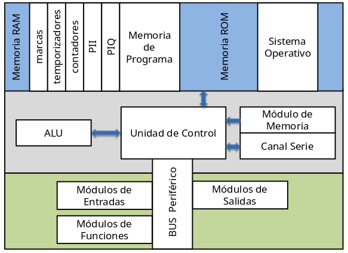
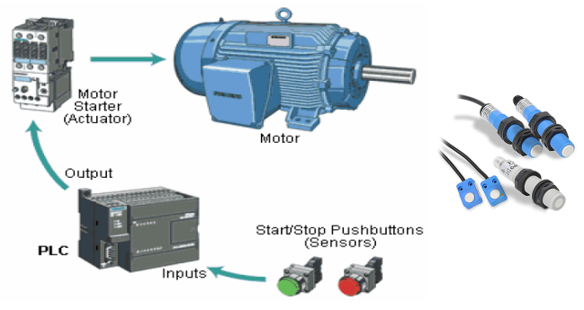
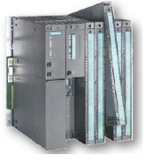
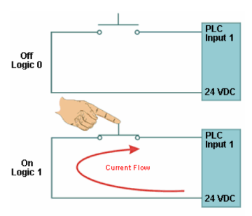
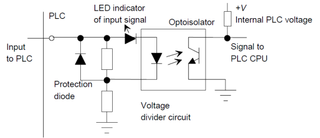
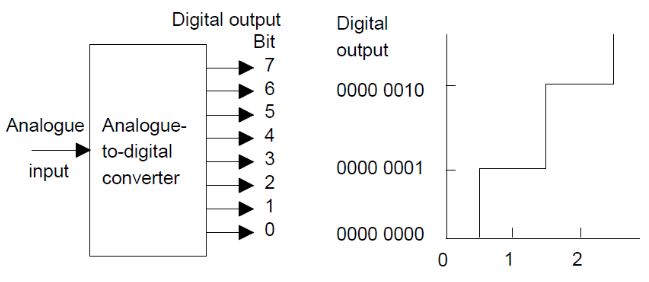
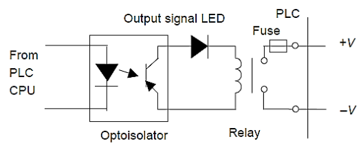
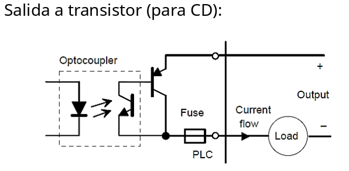
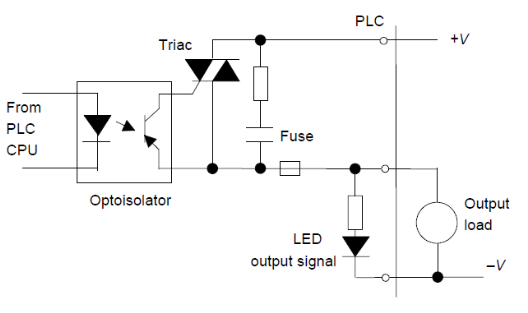
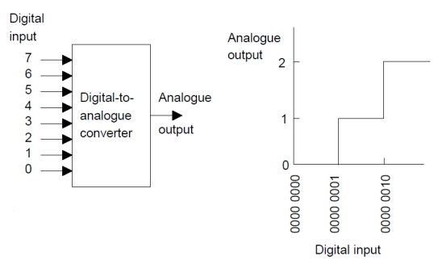

# PLC

## Introducción a los Autámatas Programables

::: tip Controlador Lógico Programable (Programmable Logic Controllers, PLC por sus siglas en inglés)

Un PLC es un equipo electrónico programable, diseñado para controlar en tiempo real y en ambiente industrial procesos secuenciales o combinacionales.
:::

### Antecedentes e historia

Década del 60:

- General Motors lanza un concurso con el objetivo de encontrar una solución tecnológica que le permitiera abaratar los costos de automatización de sus líneas de ensamblajes de automóviles que se modernizaban constantemente. El concurso fue ganado por una empresa llamada BedFord Associates que propuso un dispositivo denominado Controlador Digital Modular (MODICON) que se convirtió en el precursor de los PLC modernos.

Década del 70:

- Aumenta la capacidad de procesamiento de los microprocesadores existentes, mejorando las prestaciones de los pequeños PLC.
- Surge la necesidad de comunicación entre estos dispositivos, apareciendo el bus MODBUS, además de otra serie de buses propios de los fabricantes siendo incompatibles unos con otros.
- Surge también la necesidad de enviar y recibir señales analógicas.

Década del 80:

- Se produjo un intento de estandarización de las comunicaciones con el protocolo MAP (Manufacturing Automation Protocol) impulsado por General Motors.
- Se redujeron las dimensiones del PLC y se pasó a programar con ordenadores personales en vez de hacerlo mediante los clásicos terminales de programación a pie de planta.

Década del 90:

- Se estandariza (IEC 61131-3) el sistema de programación de todos los PLC, posibilitando que los mismos pudieran ser programados en:

IL: lista de instrucciones.
ST: Texto estructurado.

FBD: diagramas de bloques.
LD: lenguaje de contactos (LADDER).
SFC: Carta de funciones secuenciales.

### Campos de aplicación

Los PLC se emplean en la mayoría de los sectores industriales.

En general en el control de procesos o máquinas, donde los espacios sean reducidos, en procesos de producción periódicamente cambiantes, en procesos secuenciales o combinacionales y en instalaciones cuyos procesos sean complejos.

**Mecánica y automóvil:** Se encuentra en líneas de fabricación y montaje, bancos de ensayo de motores, prensas, tornos automáticos, rectificadoras, máquinas transfer, máquinas de soldar, robots.

**Transportes:** Selección de paquetes, gestión mecanizada de parques de almacenamiento, embalajes, ascensores, gestión de aparcamientos urbanos.

Procesos de fabricación en cadena como embotellado, etiquetado, pesaje y dosificación, entre otros.

### Características generales

- Están adaptados al entorno industrial, es decir, a las condiciones ambientales de los talleres de producción, plantas y fábricas. (IP)
- Ocupan un espacio mucho menor que los tradicionales paneles de control de relés (lógica cableada).
- Al ser sistemas programables son muy versátiles.
- La velocidad de ejecución es lo suficientemente elevada como para permitir el control de un proceso en tiempo real.
- El mantenimiento es sencillo debido a que suelen incorporar funciones de diagnóstico que permiten localizar fácilmente las averías.
- Su diseño puede ser modular, lo que permite la sustitución de los módulos averiados sin necesidad de poner todo el sistema fuera de servicio.
- Incorporan facilidades de comunicación que les permiten intercambiar datos con otros PLC's o con ordenadores u otros sistemas informáticos y de comunicaciones.

### Limitaciones de los PLCs

- El costo inicial puede ser alto.
- Requieren personal capacitado.
- A pesar de los esfuerzos por estandarizar los lenguajes de programación, aún existen diferencias considerables entre las instrucciones o símbolos empleados por las distintas empresas que los producen.

### Estructura PLCs

Conceptos Preliminares:

Microprocesador: cuando se usa este término se refiere exclusivamente a la unidad central de procesamiento (CPU), que consiste en el circuito electrónico inteligente capaz de ejecutar instrucciones de un programa, hacer cálculos aritméticos, lógicos y manipular datos.

Tipos de memoria:

- Memoria ROM: su nombre viene de memoria de solo lectura (en inglés Read Only Memory) y su contenido permanece constante incluso ante la falta de tensión.
- Memoria RAM: se corresponde con el término de memoria de acceso aleatorio (en inglés Random Access Memory). Esencialmente es la memoria donde la CPU puede leer o escribir datos en cualquier momento y su contenido es volátil

Clases de memoria según el empleo:

- Memoria de programa: es la memoria sobre la cual se almacenan las instrucciones que forman el programa que la CPU debe ejecutar.
- Memoria de datos: en ella se encuentran los datos que la CPU, durante el curso de la ejecución de un programa, va necesitando y/o produciendo.

### Arquitectura de los PLCs

Zona de memoria RAM:

- Marcas
- Temporizadores
- Contadores
- PII: Imagen de las entradas
- PIQ: Imagen de las salidas
- Memoria de Programa (programa del usuario)

Zona de memoria ROM:

- Almacena el sistema operativo del PLC

CPU:

- Unidad aritmética y lógica (ALU): es responsable de la manipulación de los datos, de llevar a cabo operaciones aritméticas y lógicas.
- Memoria de Registros: usado para almacenar información referente al programa en ejecución.
- Unidad de control: se encarga de controlar los tiempos de operación.

Unidad de entrada/salida:

- Es la interfaz entre el sistema y el mundo exterior, permitiendo que se conecten a través de estos canales dispositivos tales como: sensores, motores y válvulas solenoides, entre otros.

### Extructura externa de los PLCs

Compacta:

- Se usa para automatismos lógicos con equipos pequeños y donde las entradas/ salidas (E/S) son fijas. En un solo bloque están todos los elementos.

Modular:

- Se usa en PLC industriales. Posee módulos desmontables y es posible expandir los módulos de entradas y salidas.

Fuente de alimentación:

- Es la encargada de convertir la tensión de la red eléctrica en la tensión de trabajo del PLC a utilizar (110 VCA/220 VCA a 24 CD regulado).

### Unidad de entrada-salida (E/S)

En la unidad de Entrada-Salida se encuentran los dispositivos básicos por donde se toma la información de los captadores, en el caso de las entradas, y por donde se realiza la activación de los actuadores, en las salidas.

En los Autómatas compactos, la unidad de E/S se encuentra situada en un solo bloque junto con el resto del Autómata.

En el caso de los modulares, la unidad de E/S son módulos o tarjetas independientes con varias E/S, y que se acoplan al bus de datos por medio de su conductor y conector correspondiente, o bien a un bastidor o rack, que le proporciona dicha conexión al bus y su soporte mecánico.

#### Sección de entradas

Digitales (señales discretas): generalmente son las señales más utilizadas y se corresponde a un estado lógico de todo o nada, es decir a un nivel de tensión determinado o a la ausencia del mismo.

Mediante la interfaz adecuada la sección de entrada adapta, protege eléctricamente y codifica de forma comprensible por la CPU las señales que provienen de los dispositivos de entrada o captadores.

Las entradas son fácilmente identificables, debido a que se caracterizan físicamente por sus bornes para acoplar los dispositivos de entrada o captadores, por su numeración, y por su identificación INPUT o ENTRADA. Llevan además una indicación luminosa que indica el estado activo de la señal.

En cuanto a su tensión, las entradas pueden ser de tres tipos:

- Libres de tensión.
- A corriente continua (CD).
- A corriente alterna (CA).

Analógicas (señales de tipo proporcional): cuando la magnitud que se acopla a la entrada corresponde a una medida de, por ejemplo, presión, temperatura, velocidad, flujo, entre otras. Su principio de funcionamiento se basa en la conversión de la señal analógica a código binario mediante un conversor analógico-digital (A/D).

Función del convertidor analógico-digital:

Parámetros más frecuentes en el uso de los módulos A/D.

Rango de intensidad o tensión CD

- 0 ..... 10V
- -10 V ..... +10 V
- 1 ..... 5V
- 0 ..... 20 mA
- 4 ..... 20 mA

Resolución

- 8 bits
- 10 bits
- 12 bits

#### Sección de salidas

La sección de salida trabaja de forma inversa a la de entrada, es decir, decodifica las señales procedentes de la CPU, las amplifica y comanda con ellas los dispositivos de salida o actuadores, como lámparas, relés, contactores, arrancadores y electroválvulas entre otros, aquí también existe una interfaz de adaptación a la salida y de protección de circuitos internos.

En cuanto al tipo de señal que manejan al igual que las entradas, las salidas pueden ser analógicas y digitales.

Las salidas digitales se pueden encontrar de tres tipos:

- Salida a relé (para CD y CA).
- Salida a triac (para CA).
- Salida a transistor (para CD).

Salida a relé (para CD y CA):

Salida de transistor (para CD):

Salida a triac (para CA):

Las salidas analógicas presentan un convertidor digital-analógico (D/A) que realiza la función inversa a la de la entrada.

Rango de intensidad o tensión de salida

- 0 ..... 10V
- -10 V ..... +10 V
- 1 ..... 5V
- 0 ..... 20 mA
- 4 ..... 20 mA

Función del convertidor digital-analógico:

#### Dispositivos periféricos e interfaces

**Interfaces:** son circuitos que permiten la comunicación de la CPU con el mundo exterior llevando la información acerca del estado de las entradas y transmitiendo las órdenes de activación de las salidas.

Permiten también la introducción, verificación y depuración del programa mediante la consola de programación, así como la grabación del programa.

**Periféricos:** son elementos auxiliares y físicamente independientes del PLC, los equipos periféricos realizan funciones concretas y de gran importancia.

Algunos de estos dispositivos son:

- Chips de memoria.
- Impresoras.
- Paneles de operación (OP).
- Computadoras industriales.
- Lectores de código de barra.
- Entre otros.

::: tip Opcional
Estudiar conceptos de compuertas digitales AND, OR, XOR, etc y Mapas de Karnaugh.
:::
