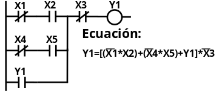

# Programación de PLCs

## Sistemas numéricos

Esencialmente son tres los sistemas numéricos más en la programación de los PLCs:

- Decimal.
- Binario.
- Hexadecimal.

| Decimal | Binario | Hexadecimal |
| :-----: | :-----: | :---------: |
|    0    |  0000   |      0      |
|    1    |  0001   |      1      |
|    2    |  0010   |      2      |
|    3    |  0011   |      3      |
|    4    |  0100   |      4      |
|    5    |  0101   |      5      |
|    6    |  0110   |      6      |
|    7    |  0111   |      7      |
|    8    |  1000   |      8      |
|    9    |  1001   |      9      |
|   10    |  1010   |      A      |
|   11    |  1011   |      B      |
|   12    |  1100   |      C      |
|   13    |  1101   |      D      |
|   14    |  1110   |      E      |
|   15    |  1111   |      F      |

Estructura números enteros:

## Funciones lógicas

Cuando se refiere a cantidad física en los números binarios (variables binarias) se expresa que pueden existir uno de dos estados lógicos representado en 1 ? 0.

Estas variables binarias se pueden combinar dando como resultado una nueva condición de Verdadero o Falso representado en 1 ó 0 respectivamente.

Para el programador el resultado de estas combinaciones es de gran importancia en la toma de decisiones. Existen tres funciones básicas en el uso de los PLC:

- Función AND.
- Función OR.
- Función NOT.

### Función AND

La función AND lógica puede tener un ilimitado número de entradas pero solo una salida. En el álgebra booleana el operador AND representa la operación de multiplicación.

**Ejemplo:** Y es 1 si A AND B es 1, Y = A\*B.

Ejemplo de diagrama de lógico, eléctrico y de contacto

### Función OR

La función OR lógica también puede tener un ilimitado numero de entradas pero solo una salida. En el algebra booleana el operador OR representa la operación de suma.

**Ejemplo:** Y es 1 si A OR B es 1, Y = A+B.

Ejemplo de diagrama de lógico, eléctrico y de contacto

### Función NOT

La función NOT también llamada inversor se utiliza para invertir el valor de una determinada condición.

**Ejemplo:** La salida de la función NOT será VERDADERA (1) si la entrada es FALSA (0), Y = /A.

Ejemplo de diagrama de lógico, eléctrico y de contacto

## Estructura y ejecución de un programa

Un programa es una sucesión o lista en un determinado orden de distintas órdenes de trabajo también llamadas instrucciones capaz de hacer ejecutar al Autómata la secuencia de trabajo pretendida.

### ¿Qué es una instrucción?

Una instrucción u orden de trabajo, es la parte más pequeña de un programa. Consta de operaciones (código) y operando (complemento al código). Pueden ser de diversos tipos: aritméticas, lógicas, para el tratamiento de registros, memorias y elementos de E/S entre otros.

Los Autómatas suelen tener principalmente dos modos de operación:

- **STOP:** Contacto de arranque abierto o programa sin ejecutar. Todas las salidas del PLC se encuentran en reposo. En esta condición se puede escribir y corregir el programa.
- **RUN:** Contacto de arranque cerrado. Las instrucciones del programa se ejecutan continuamente.

### ¿Cómo se ejecutan los programas?

Cuando el Autómata se siú?a en ciclo de ejecución o ejecución cíclica, la CPU realiza entre otras funciones, el barrido del programa contenido en la memoria de usuario desde la dirección 0000 hasta la última posible según sea el tamaño de la memoria.

A esta lectura se le denomina ciclo de Scanning.

### Consideraciones previas a la programación

- Los términos contacto abierto, normalmente abierto (NO) y contacto de cierre tienen igual significado y se refiere al contacto que en estado de reposo está abierto y no permite el paso de la corriente.

- Los términos contacto cerrado, normalmente cerrado (NC) y contacto de apertura también tienen igual significado y es el contacto que en estado de reposo permite el paso de la corriente.

- Contactos normalmente abiertos y normalmente cerrados:

- El número de contactos abiertos o cerrados que se utilizan en un programa asociados a una entrada es ilimitado.

- El número de salidas o bobinas de salidas es fijo, por lo que no se puede repetir el mismo número de salida. Por el contrario el número de contactos asociados a esta si es ilimitado.

- No se puede conectar una salida directamente a la línea principal. No se pude conectar un contacto después de la salida.

- Si se puede asociar un contacto a una salida determinada.

- La programación en cada bloque de contactos se realiza de izquierda a derecha. a)

- El sentido de programación de los bloques de contactos se ejecutan de arriba hacia abajo. b)

Marcas:

- Registros que guardan resultados intermedios del programa durante el ciclo de ejecución del Autómata.
- Las marcas pueden estar o no en zonas protegidas de memoria para casos de corte de tensión.
- Se utilizan como sustitutos de relés auxiliares de la lógica cableada.
- Al igual que en las salidas el número de marcas es fijo, no se puede repetir, pero el número de contactos asociados a esta es ilimitado.

## Lenguajes de programación.

Varios son los lenguajes de programación utilizados por los diferentes fabricantes de PLC aunque su utilización no se puede dar en todos los Autómatas que producen; es por esto que cada fabricante indica en las características generales del equipo el lenguaje o lenguajes con los que se puede operar.

Los lenguajes de programación se pueden dividir en dos grupos:

- Lenguajes gráficos.
- Lenguajes de textos.

Definiendo un proceso simple y partiendo de su función lógica a continuación se explicará cada uno de estos lenguajes:

### Diagrama de contactos o esquema de contactos Ladder

La mayoría de los fabricantes incorporan este lenguaje, ello es debido a su semejanza con los esquemas de relés utilizados en la lógica cableada, lo que facilita la labor de los técnicos habituados a trabajar con estas técnicas de automatización.

### Plano de funciones o bloques funcionales FBD

Su semejanza con los símbolos lógicos o compuertas lógicas hace interesante este lenguaje por la facilidad en su representación para los conocedores de la electrónica digital.

### Diagrama de etapas o fases SFC

El GRAFCET es un método por el cual se describen en una forma gráfica las especificaciones de cualquier automatismo.

Es ampliamente usado en procesos y operaciones secuenciales donde el flujo de programa cambia de un estado a otro si se ha alcanzado una condición determinada.

### Nemónico, lista de instrucciones o booleano IL

El lenguaje IL se basa en las definiciones del álgebra de Boole o álgebra lógica. Es un lenguaje similar al lenguaje ensamblador o código de máquina de los microprocesadores y se utiliza cuando se quiere lograr mayor optimización en el programa y ahorro de los recursos del PLC.

### Lenguaje estructurado ST

Es un lenguaje de alto nivel que incorpora estructuras básicas de lenguajes como BASIC o PASCAL. Es particularmente utilizado para manipular diferentes tipos de datos, operaciones matemáticas que implementen coma flotante y es de gran utilidad para encapsular y crear funciones así como implementar inteligencia artificial, lógica fuzzy entre otras aplicaciones.

## Ejemplo de programación con lógica de contactos (ladders)

Descripción del proceso:
Encienda una lámpara que indique la combinación de la activación del sensor de nivel 1 de un determinado proceso junto a la activación del sensor de nivel 2 o un push-button normalmente abierto.

PL1 = (PB1+LS2)\*LS1

::: tip Ejercicio propuesto

Se requiere automatizar un paso vehicular con barrera conformado por los siguientes elementos:

- Una barrera accionada por un motor (M1).
- Dos sensores de fin de carrera (S1 y S2) para indicar si la barrera está subida o bajada.
- Dos botones de tipo pushbutton (P1 y P2) en la caseta del operador para subir y bajar la barrera.
- Un semáforo de dos colores: VERDE y ROJO.

Descripción del proceso:

- La barrera se encuentra normalmente levantada permitiendo el paso vehicular.
- Cuando el operador reciba la orden de bajar la barrera, este pulsa P1 y la barrera baja permaneciendo así hasta que el operador pulse P2 para subirla nuevamente.
- Mientras el paso está permitido se alumbrará la luz verde y en caso contrario la luz roja.
  :::

::: tip Ejercicio propuesto
Realizar el control de una puerta corrediza con el siguiente funcionamiento:

- La apertura y cierre de la puerta se acciona por medio de un motor trifásico. El movimiento de apertura se controla por medio del contactor K1 y el de cierre por medio del contactor K2.
- El interruptor S1 de fin de carrera se opera cuando la puerta está abierta y el interruptor S2 cuando la puerta está cerrada.
- La puerta se abre cuando el sensor S3 detecte presencia de personal y se cierra en caso contrario.
- La lámpara L2 indica que la puerta se está abriendo y la lámpara L1 que la misma se está cerrando.
  :::
