# Sistemas de supervisión y gestión

Con el avance de la automatización surgen otras necesidades en la industria:

- Control de sistemas separados por largas distancias desde una localización central
- Predecir situaciones anómalas
- Toma de decisiones rápida y eficaz
- Producción flexible a las necesidades de los consumidores y cambios en el abastecimiento
- Aumentar ganancias y disminuir los costos

| Necesidades                                                                      | Soluciones                                                |
| -------------------------------------------------------------------------------- | --------------------------------------------------------- |
| Control de sistemas separadospor largas distancias desde unalocalización central | Comunicación rápida y a largas distancias                 |
| Predecir situaciones anómalas                                                    | Sistemas de adquisición y detección de anomalías          |
| Toma de decisiones rápida y eficaz                                               | Representación del estado actual y previo de los procesos |

¿Qué necesitamos? => Sistemas de supervisión

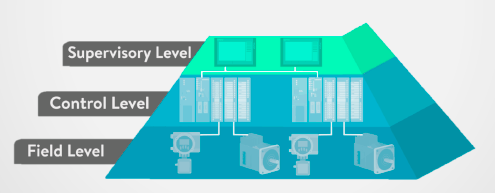

| Necesidades                                                                              | Soluciones                                      |
| ---------------------------------------------------------------------------------------- | ----------------------------------------------- |
| Producción flexible a las necesidades de los consumidores y cambios en el abastecimiento | Optimizar los procesos de producción            |
| Aumentar ganancias y disminuir los costos                                                | Automatizar el proceso de gestión de la empresa |

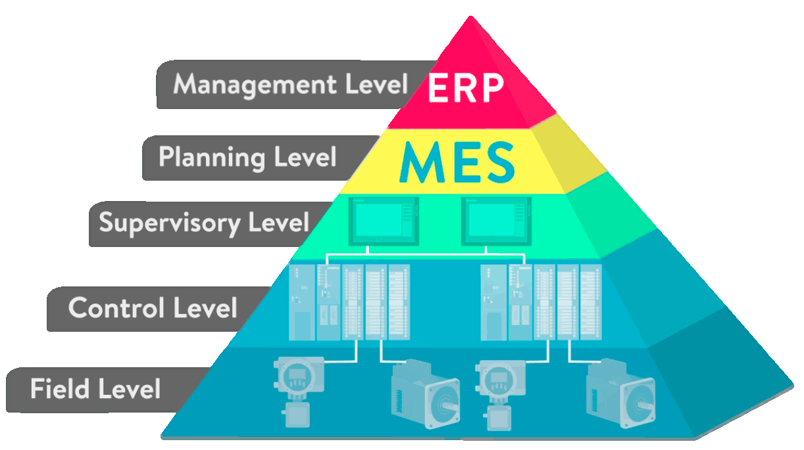
¿Qué necesitamos? => Sistemas de gestión

## Sistemas SCADA (**S**upervisory, **C**ontrol **A**nd **D**ata **A**cquisition)

Colección de componentes de hardware y software que permite:

- Supervisión y control de plantas industriales, local y remotamente
- Adquisición, almacenamiento y procesamiento de datos en tiempo real.

### Estructura

Combinación de 4 subsistemas:

1. Computadora central
2. Unidad terminal remota (RTU)
3. Sistema de comunicación de gran escala
4. Interfaz de operador

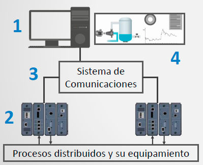

Años 1960 - principios 1980:

Arquitectura centralizada con redundancia.

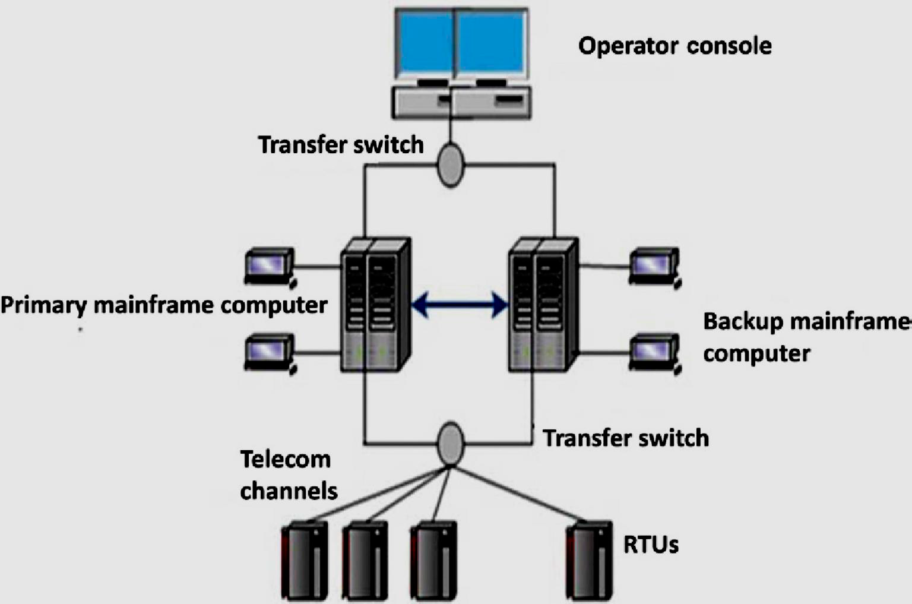

Años 1980 - actualidad:

Arquitectura distribuida.

- Separación de Funciones

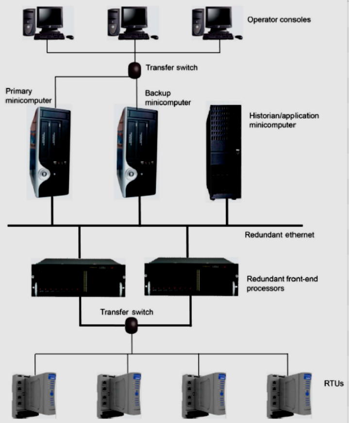

Años 1990 - actualidad:

Arquitectura Cliente/Servidor.

- Separación de Funciones.
- Mayor flexibilidad en el diseño.

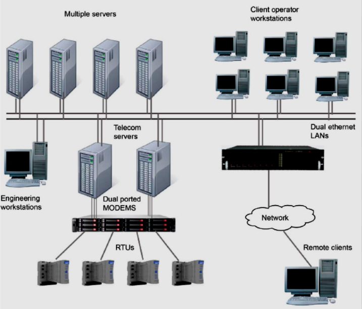

### Funcionalidades

- Adquirir datos de los instrumentos de campo mediante RTU
- Almacenar y analizar datos históricos
- Proveer una base de datos consistente con la información del proceso
- Realizar el control remoto de dispositivos de campo
- Presentar los datos mediante interfaces de usuario gráficas de fácil comprensión, alarmas, tendencias, y reportes
- Monitorizar y diagnosticar los sistemas y tomar de acciones apropiadas
- Integrar e intercambiar datos de la planta o proceso con aplicaciones informáticas de gestión de información
- Proveer información en tiempo cuasi real acerca del estado actual de procesos remotos
- El rol supervisor de los SCADA actuales queda relegado básicamente a la activación y registro de alarmas asociadas al traspaso de umbrales por parte de variables analógicas

## Supervisión VS Monitorización

**Monitorización:** Automatización del proceso de vigilancia de un proceso dotando al operario de los mecanismos necesarios para su alerta , así como la interacción amigable con el proceso y el registro de su evolución (históricos).

- La centralización de todos los datos de proceso en un ordenador (o red).
- Adquisición y registro de datos.
- Representación gráfica.
- Notificación de alarmas.

**Supervisión:** Automatización del proceso de vigilancia de un proceso utilizando sus datos para decidir sobre su correcto funcionamiento y proponer las acciones adecuadas para mantener los objetivos productivos fijados para el proceso.

- Monitorización
- Analizar las desviaciones de las variables y deducir el motivo.
- Elaborar un diagnóstico de la situación.
- Asistir al operador en la toma de decisiones y resolver automáticamente la situación problema en caso de ser posible.

### Etapas fundamentales de la supervisión

- Detección de fallos: Obtención de indicadores de fallo y su evaluación continuada, seguido de un proceso de decisión.
- Identificación/Aislamiento de fallos: Procedimiento deductivo que lleva al origen del fallo, su localización y magnitud.
- Reconfiguración: Acciones a realizar para mantener el proceso operativo.

## Sistemas SCADA. Características del hardware

### RTU

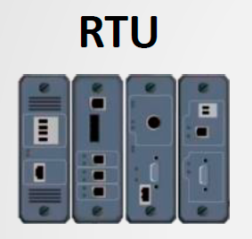

Equipamiento de medición y control localizado en el campo.

Provee una interfaz para la adquisición de datos de sensores analógicos y digitales en el campo situados en cada sitio remoto.

Para lograr el tiempo requerido de refrescamiento de las mediciones en el sistema SCADA se debe tener en cuenta:

- Velocidad de los circuitos de comunicación
- El número de RTUs que comparten un circuito
- El tamaño y número de mensajes a intercambiar
- El número de circuitos utilizados de forma secuencial o recurrente
- La demora característica del circuito

### Sistema de comunicación

Provee un camino para la comunicación entre la estación
maestra y los sitios remotos.

- Puede ser cable, fibra óptica , radio, líneas telefónicas, microondas y posiblemente satélite.
- Para una eficiente y óptima transferencia de datos se utilizan protocolos específicos y formas de detección de errores.

### Estación maestra

Reune datos de varios RTUs y, generalmente, provee una interfaz de operador para mostrar información y el control de los sitios remotos.

Es una aplicación o conjunto de aplicaciones informáticas para
auxiliar al operador del proceso según su nivel de acceso

- Interfaz gráfica de alto nivel:
  - Alarmas
  - Tendencias
  - Acceso a datos de planta o proceso
- Ejecución de programas:
  - Modificar una ley de control
  - Modificar las tareas asociadas al autómata
- Interfaz de comunicación con RTU (y PLC)
- Escalabilidad
- Bases de datos
- Redundancia y tolerancia a fallos
- Arquitectura Cliente/Servidor

## Representación de procesos

- La representación de procesos, o sea, la representación visual de la información y su interactividad es muy importante en un SCADA.
- Se le suele llamar interfaz hombre máquina (HMI, MMI) y debe dedicársele un gran tiempo debido a su importancia en la descripción del proceso tecnológico y de su evolución.

Primeras interfaces de procesos

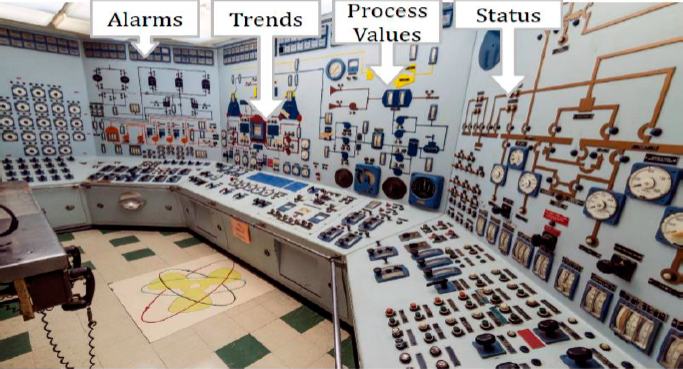

Interfaces posteriores con el surgimiento de los sistemas informáticos y las interfaces gráficas

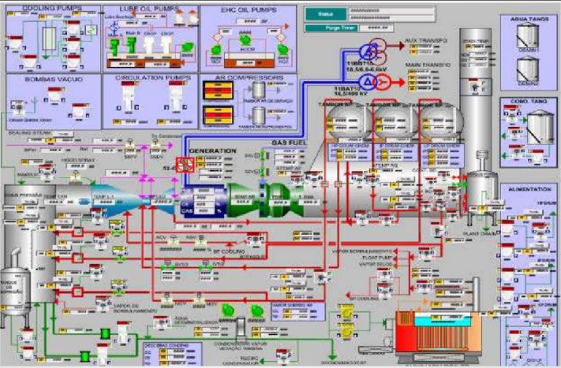

## Datos VS Información

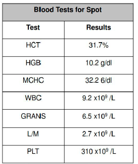
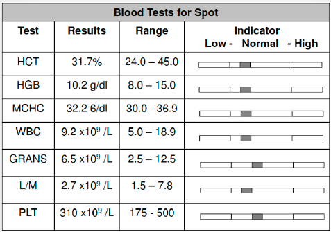

Ejemplo industrial

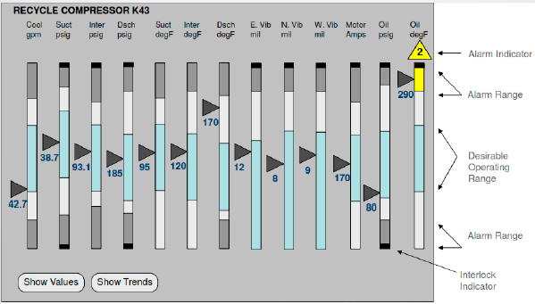

### Existe un Estándar. ISA 101 (2015)

Human Machine Interfaces for Process Automation Systems

El propósito de este estándar es:

- Abordar la filosofía, diseño, implementación, operación, y mantenimiento de Interfaz Persona Máquina ( HMIs ) para sistemas automáticos de procesos.
- Ayudar a los usuarios a comprender los conceptos básicos como una forma de mejora y acepte fácilmente el estilo de HMI que el estándar recomienda.

### Representación de procesos ISA 101 (2015)

Define la terminología y modelos para desarrollar un HMI y los procesos recomendados para mantener efectivamente el HMI durante su ciclo de vida.

El uso del estándar debe:

- Proveer guía para disenar, construir, operar y mantener HMIs para lograr un sistema de control más Seguro, efectivo y eficiente bajo cualquier condición de operación.
- Mejorar las habilidades del usuario para detectar, diagnosticar y responder apropiadamente a situaciones anormales.

### Ciclo de vida de un HMI

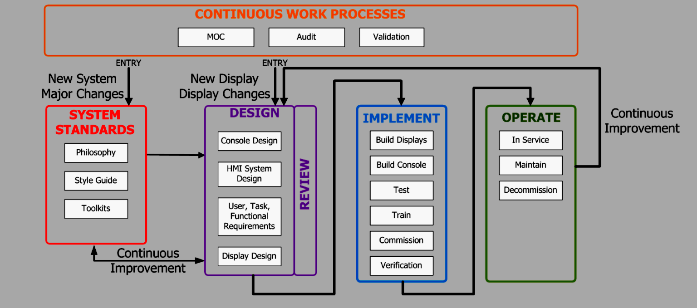

### Niveles de jerarquía

- **Level 1** - Plant or Entire System Overview
  - Entire Operator Span of Control. “Single Glance”
- **Level 2** - Sub Process Overview
  - More details than a Level 1 display, smaller area
- **Level 3** - Equipment or Details Screen
  - Specific details about part of the process or control
- **Level 4** - Specific Task or Diagnostic Screen
  - Very detailed screen, only used for diagnostics

#### Nivel 1: Planta

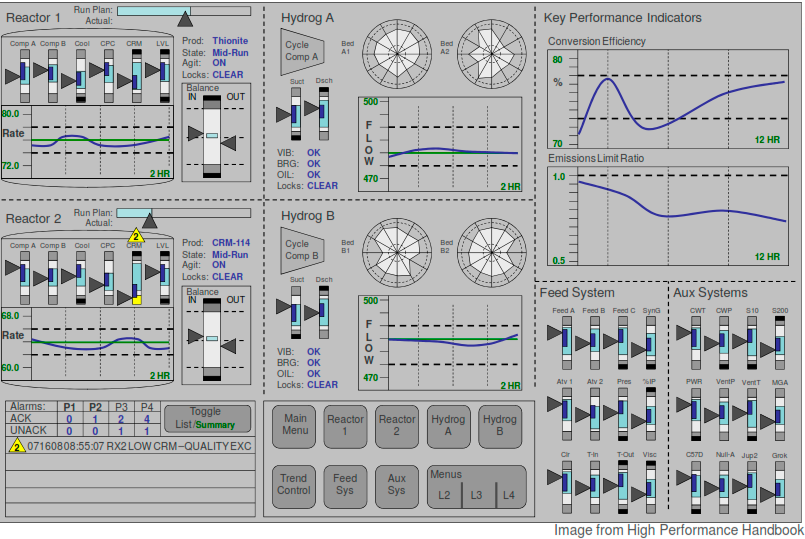

#### Nivel 2: Sub-proceso

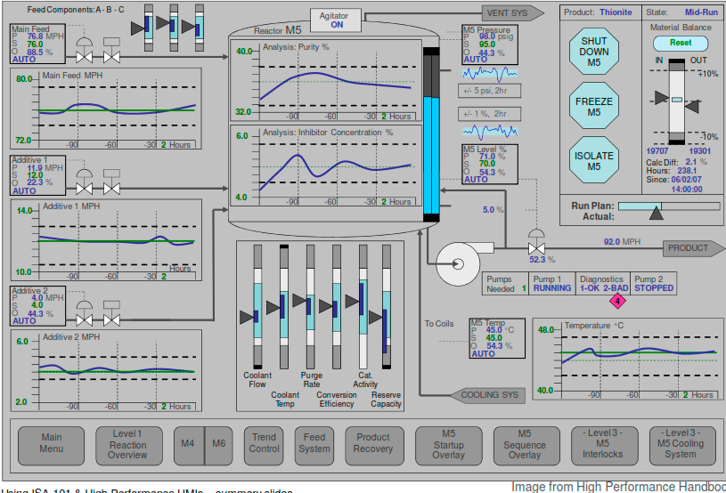

#### Nivel 3: Equipamiento

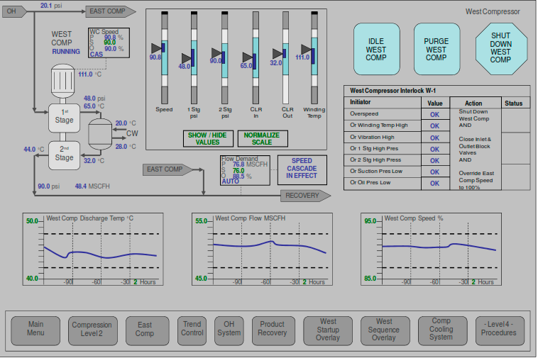

## Elementos de diseño

A considerar

- Gráficos de tendencias
- Colores a utilizar
- La navegación
- Elección de los elementos (iconografía) y su tamaño
- Colocación de elementos en la pantalla
- Los caracteres y su ubicación

### Gráficos de tendencia para mostrar información

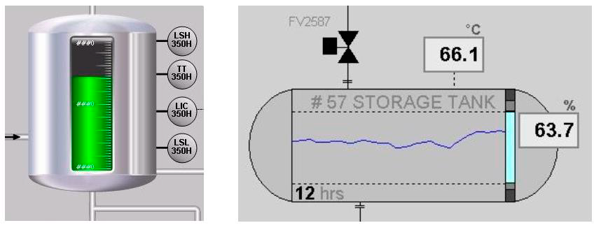
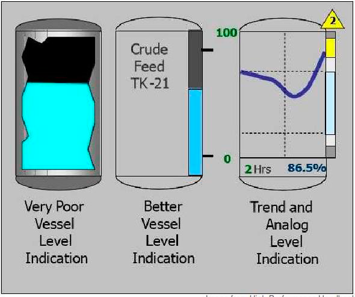

### Color

Principios básicos propuestos para el uso del color

- Fondos grises para minimizar el resplandor y promover entornos de poco contraste
- Los colores brillantes se utilizan para resaltar alarmas y situaciones anómalas
- Los colores utilizados para las alarmas no se utilizan en nada más

#### La regla más importante

**No hay que utilizar más colores de los necesarios** no es
conveniente convertir las pantallas en ejercicios de diseño
gráfico, lo único que consiguen son pantallas vistosas pero
poco prácticas

#### Los Colores y su efecto psicológico

| Color    | Percepción     | Temperatura  | Efecto      |
| -------- | -------------- | ------------ | ----------- |
| Rojo     | Cercanía       | Caliente     | Estimulante |
| Naranja  | Mucha cercanía | Muy caliente | Excitante   |
| Verde    | Lejanía        | Frío-Neutro  | Relajante   |
| Amarillo | Cercanía       | Muy caliente | Excitante   |
| Azul     | Lejanía        | Frío         | Relajante   |
| Violeta  | Cercanía       | Frío         | Excitante   |

Niveles de percepción de colores (ANSI) (American National Standards Institute ) (Mayor a menor)

| Orden | Color    | Fondo    |
| ----- | -------- | -------- |
| 1     | Negro    | Amarillo |
| 2     | Verde    | Blanco   |
| 3     | Rojo     | Blanco   |
| 4     | Azul     | Blanco   |
| 5     | Blance   | Azul     |
| 6     | Negro    | Blanco   |
| 7     | Amarillo | Negro    |
| 8     | Blanco   | Rojo     |
| 9     | Blanco   | Verde    |
| 10    | Blanco   | Negro    |
| 11    | Rojo     | Amarillo |
| 12    | Verde    | Rojo     |
| 13    | Rojo     | Verde    |

#### Colores grises + Complementos

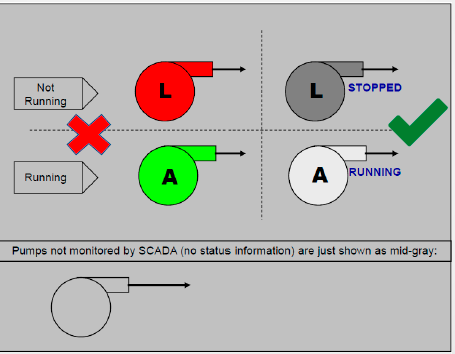

#### Colores de fondo

- Es aconsejable que todas las pantallas de una misma categoría tengan el mismo color de fondo (se crea una respuesta automática del usuario).
- Por ejemplo, si todas las pantallas de alarma tienen el mismo color de fondo solo hace falta mirar al monitor para saber si algo va mal, sin necesidad de leer el contenido

Algunas reglas generales

- El uso de colores de muy alto contraste puede convertir una ventana de la aplicación en incómoda o casi ilegible. Por ejemplo, ciertas combinaciones de tonos azules y verdes pueden dar resultados explosivos.
- Los colores extremos del espectro (rojo y azul) no deberían aparecer simultáneamente en pantalla, pues someten los ojos a esfuerzos excesivos de acomodación y provocan efectos indeseables de profundidad.

Llamativo? = Mal diseño

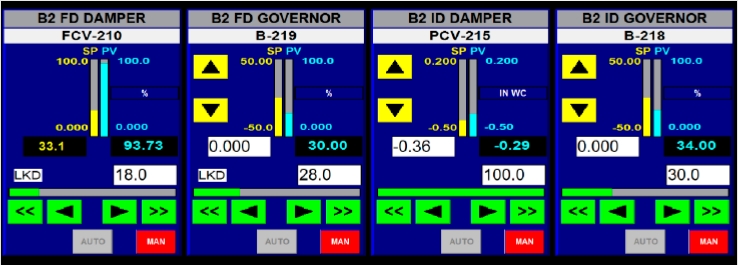

Buen uso del color

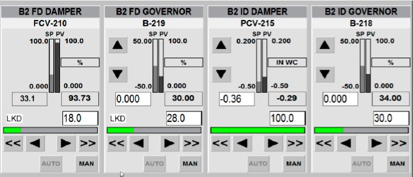

## Navegación

- El intercambio entre las ventanas debe configurarse a través de menús y botones de forma que el usuario se familiarice rápidamente.
- Barra de navegación general fija y con la misma orientación (horizontal o vertical).
- Acceso rápido a sinóptico de alarmas.

### Ejemplo SCADA la Pradera

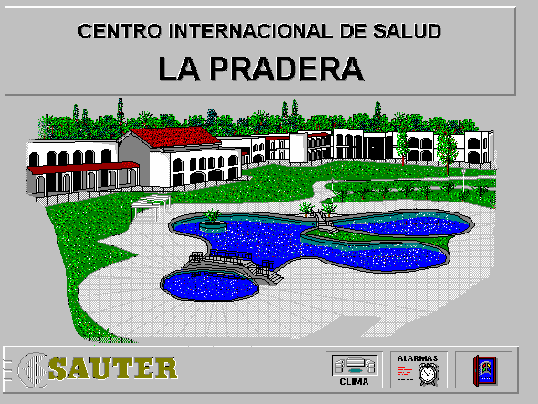

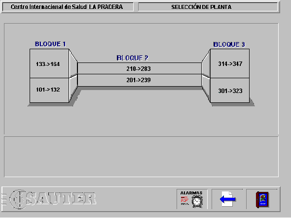

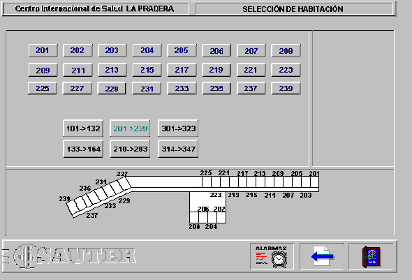

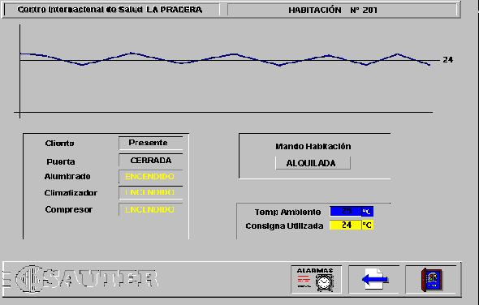

## Distribución de los elementos

Campo Visual:

- Campo de visión Neta Es la zona de visión nítida, necesaria para tareas de precisión
- Campo Medio Zona de visión menos precisa, aquí se aprecian contrastes fuertes y movimientos
- Campo Periférico Zona de visión periférica, los objetos se distinguen si se mueven

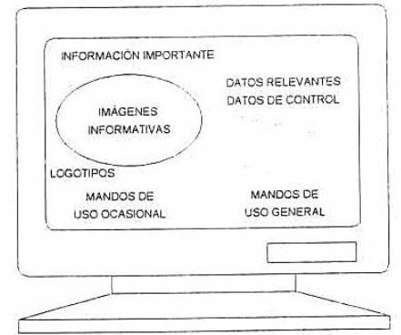

### Aspectos generales

- Los caracteres de pantalla deben estar bien definidos y configurados de forma clara, y tener una dimensión suficiente, disponiendo de un espacio adecuado entre los caracteres y los renglones.
- La imagen de la pantalla debe ser estable, sin fenómenos de destellos u otras formas de inestabilidad.
- Las pantallas deben tener una apariencia consistente en todo el proyecto, teniendo zonas diferenciadas.
- La representación del proceso se organiza de acuerdo con la distribución física de las unidades de producción (Topología).
- Tener en cuenta el sentido de lectura y observación normal.
- La información numérica presentada se hará sobre los elementos gráficos que la generan.
- La presencia de intermitencias llama la atención del observador, pero dificultan su lectura, por tanto se utilizarán en partes gráficas y no en textos.

## Ejemplo SCADA

Explotación minera de Olympic Dam, en Australia, el mayor sistema
Scada del mundo basado en Windows

Compañía minera WMC, en 1988 la zona de Olympic Dam producía inicialmente 45 000 toneladas anuales de cobre y derivados La producción, en aumento año tras año, pedía más medios para aumentar el rendimiento y se optó por "rediseñar" todo el sistema:

- Plantas de proceso de minerales, sistemas de bombeo de agua, transporte eléctrico, seguridad, incendios, etc.
- En 1999 tenía más de 440 000 variables y el tiempo medio de respuesta era de 0.014 segundos

**Hardware**: PLCs Allen Bradley y Siemens Conexión con PMACS, PDL y Servidores SQL

Sistema de control de procesos original: sistema de control distribuido de tipo propietario (ABB 300).

Control sobre unas **400 000 variables** y unas 40 000 entradas/salidas digitales.

Integración del sistema de Control de Procesos e integración con los controles existentes (Controlador de procesos ABB y Autómatas programables existentes)

- 148 Autómatas programables (Allen Bradley, Siemens y otros) y el paquete Scada Citect
- 60 Estaciones de Operador Citect
- 10 servidores E/S (I/O servers)
- 2 servidores de gráficas (trend servers)
- 2 servidores de alarmas e informes
- 2 servidores de archivos Windows NT
- 2 servidores Microsoft SQL ( eventos y alarmas)
- Windows NT
- Ethernet

Algunas prestaciones oficiales del sistema son:

- 3 000 000 de adquisiciones hora (señales digitales)
- 63 387 señales digitales de alarma chequeadas cada segundo
- 20 445 señales analógicas, de las cuales
  - 3 500 se almacenan cada 2 segundos
  - 5 500 cada 10 segundos
  - 11 445 cada 60 segundos
- 200 gráficas de tendencia adicionales pueden configurarse online
  para hacer muestreos de 1 segundo
- 14 Gb de datos de tendencias históricas están accesibles desde cualquier nodo

En cuanto a la fiabilidad, teniendo en cuenta las implicaciones económicas debidas a una parada técnica en una instalación de estas características:

- Servidores de ficheros redundantes.
- Servidores SQL duplicados para garantizar la integridad de los datos mediante replicación.
- Almacenamiento local de datos antes de su transferencia a los servidores SQL remotos (los datos no se pierden)
- Red Ethernet redundante a 100 Mb/s, que interconecta los sistemas con el centro de control
- Los servidores de entradas Salidas I/O Servers duplicados

## MES (**M**anufacturing **E**xecution **S**ystem)

Sistemas de información que residen en la propia planta y que enlazan el sistema de información de gestión empresarial ( ERPs ) y los sistemas de supervisión (SCADAs) y control de planta

::: tip Definición
Un MES es una herramienta software empleada en la industria. La mayoría de las industrias usan una herramienta de planificación llamada ERP para determinar los productos a ser fabricados. Una vez que el plan ha sido realizado debe hacerse una traducción de dicho plan que trate con los recursos reales disponibles a nivel de planta. Ajustar y ordenar los recursos necesarios para ejecutar el plan es el rol del MES
:::

### Flujo de datos entre niveles 3 y 4

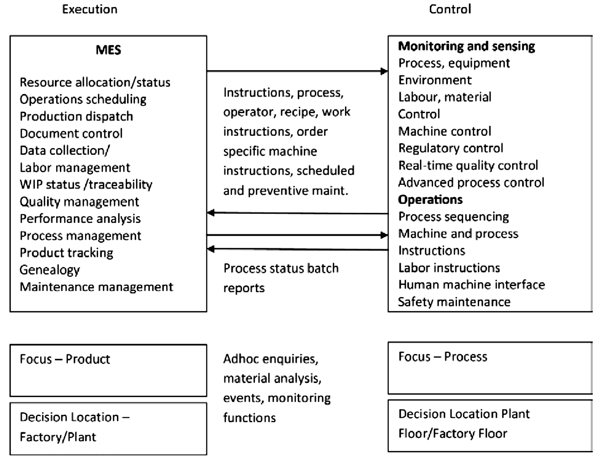

“Ejecución” significa:

- Encender y apagar las máquinas.
- Construcción y medición de partes o productos.
- Mover el inventario a o desde las estaciones de trabajo
- Cambiar el orden de las prioridades.
- Definir el valor de las consignas de los controles y los intervalos de medición de los sensores.
- Asignar y reasignar el personal.
- Programar y reprogramar los equipos.

### Ventajas MES

- Mejora de la productividad
- Mejora de la calidad
- Reducción de costes de producción
- Mejora gestión de activos
- Reducción WIP ( work-in-process inventory)
- Cumplir normativa trazabilidad

### Funciones

- Adquisición y registro de datos
- Gestión de mantenimiento
- Gestión de la calidad
- Gestión de personal y recursos
- Gestión de procedimientos
- Gestión de documentación
- Seguimiento y análisis de índices
- Trazabilidad de productos

## ERP (**E**nterprise **R**esource **P**laning)

¿Qué es un ERP?

- Es una aplicación de software que automatiza e integra tanto los
  procesos del manejo del negocio así como la producción.
- Los sistemas ERP ligan todas las operaciones de la compañía
  incluyendo: Recursos Humanos, finanzas, producción y
  distribución, así como también conecta a la empresa con sus
  clientes y proveedores.
- Los ERP ofrecen una interfaz con el usuario para ejecutar las
  actividades de la empresa y una base de datos central para
  almacenar toda la información.

### Evolución

- Años 60 - Control de Inventario: Mantenimiento de stocks ajustados (materia prima y producto fabricado).
- Años 70 - MRP Material Requirement Planning: El plan de producción gestiona la lista de componentes de los productos y genera pedidos de compra (materia prima) y de producción (componentes).
- Años 80 - MRP II Manufacturing Requirement Planning: Introduce los conceptos de capacidad de producción, plazos de entrega, recepción de materiales, etc.
- Años 90 - ERP Enterprise Resource Planning: Se extiende al resto de áreas de la empresa: finanzas, presupuestos, recursos humanos, ventas, etc.

### Funciones ERP

- Planeación de Productos
- Compras de partes
- Manejo de Inventarios
- Interacción con Proveedores
- Proveen Servicio a Clientes
- Seguimiento de órdenes
- Finanzas de la empresa
- Manejo de Recursos Humanos

### Funcionamiento de una empresa sin un sistema ERP

- Sistemas no integrados

  - Departamentales
  - Numerosas interfaces
  - Múltiple transcripción de datos
  - Traspaso de documentos papel
  - Duplicidad de datos
  - Falta de uniformidad
  - Diferencia de criterios y conceptos
  - Múltiples sistemas y plataformas
  - Múltiples tecnologías heterogéneas

- Sistemas integrados
  - ERP
  - Eliminación de interfaces
  - Procesos on line
  - Concepto de dato único
  - Continuidad en los procesos
  - Mayor interacción de los recursos
  - Uniformidad de la información
  - Actualización tecnológica continua

### Ventajas

- Incremento del control de la Empresa.
- Visión Global.
- Dato único.
- Integración de los procesos claves del negocio.
- Adaptación a requisitos actuales y futuros.
- Conectividad con sistemas externos.
- Estandarización.
- Conocimiento disponible en mercado (consultores).

## Conclusiones

La estructura interna de una aplicación SCADA comprende varios elementos que garantizan principalmente tres funciones:

- interacción con el operador
- comunicación con el proceso
- interoperabilidad con otras aplicaciones informáticas.

El uso de sistemas SCADA es de gran importancia y muestra mayores ventajas para plantas de gran dimensión con procesos distribuidos geográficamente.

La norma ISA 101 establece criterios para realizar el diseño de interfaces HMI para los sistemas de automatización industriales.

Los sistemas MES complementan la operación de la industria desempeñando funciones de control del proceso de manufactura a partir de la planificación establecida por el sistema ERP.

Los tres niveles superiores de la pirámide de automatización permiten completar la automatización de una industria a partir de las funciones de supervisión, ejecución y planificación estudiadas.

::: tip Opcional
Busque 5 ejemplos de SCADAs donde se haya realizado una correcta aplicación de la norma ISA 101, y 5 ejemplos donde no se haya considerado. Explique las desventajas que se derivan de su no utilización.
:::
